+++
tags = "webdev"
date = "8 Septemebr, 2024"
+++

# 10X Your JS Web Servers

Javascript is single threaded that means if you was running your ExpressJS (or NestJS, HonoJS, etc.), you probably run it on a single core. To take advantages of multiprocessing, you can clusterize your web services by a native package in NodeJS.

To quickly test the demo, have a look at [tuphan-dn/clusterized-express](https://github.com/tuphan-dn/clusterized-express).

## A "documented" way to run ExpressJS servers

```ts label="index.ts" group="express"
import express from 'express'

const app = express()

app.get('/', (req, res) => {
  res.send('Hello World!')
})

app.listen(process.env.PORT, () => {
  console.log(`⚡️ Listening on port ${process.env.PORT}`)
})
```

The script basically run a signle thread of the Express server on port 3000.

## A "clusterized" way to run Express servers

```ts label="index.ts" group="clusterized-express"
import express from 'express'
import cluster from 'cluster'
import process from 'node:process'

const app = express()
const cpus = 4

app.get('/', (req, res) => {
  res.send('Hello World!')
})

if (cluster.isPrimary) {
  console.log(`⚡️ Primary listening on port ${process.env.PORT}`)
  for (let i = 0; i < cpus; i++) cluster.fork()
  cluster.on('exit', (worker) => {
    console.log(`Worker ${worker.process.pid} died`)
  })
} else {
  app.listen(process.env.PORT, () => {
    console.log(`👷 Worker listening on pid ${process.pid}`)
  })
}
```

## Benchmark

In this benchmark, I will run `autocannon -c 10000 -d 10 http://localhost:3000` (estimately 1000req/sec) to both approaches on a Macbook M2 Pro with 16GB RAM.

### Single core

| Stat    | 2.5%   | 50%    | 97.5%   | 99%     | Avg       | Stdev      | Max     |
| ------- | ------ | ------ | ------- | ------- | --------- | ---------- | ------- |
| Latency | 208 ms | 532 ms | 4234 ms | 5610 ms | 996.34 ms | 1146.18 ms | 9099 ms |

| Stat      | 1%     | 2.5%   | 50%    | 97.5%   | Avg     | Stdev    | Min    |
| --------- | ------ | ------ | ------ | ------- | ------- | -------- | ------ |
| Req/Sec   | 1,123  | 1,123  | 1,427  | 9,407   | 2,601.2 | 2,386.69 | 1,123  |
| Bytes/Sec | 269 kB | 269 kB | 341 kB | 2.25 MB | 621 kB  | 570 kB   | 268 kB |

### Multiple cores

| Stat    | 2.5%  | 50%   | 97.5%   | 99%     | Avg       | Stdev      | Max     |
| ------- | ----- | ----- | ------- | ------- | --------- | ---------- | ------- |
| Latency | 72 ms | 93 ms | 4362 ms | 5615 ms | 580.59 ms | 1088.17 ms | 7710 ms |

| Stat      | 1%     | 2.5%   | 50%    | 97.5%   | Avg     | Stdev     | Min    |
| --------- | ------ | ------ | ------ | ------- | ------- | --------- | ------ |
| Req/Sec   | 1,676  | 1,676  | 3,453  | 51,615  | 8,838   | 15,203.85 | 1,676  |
| Bytes/Sec | 401 kB | 401 kB | 825 kB | 12.3 MB | 2.11 MB | 3.63 MB   | 401 kB |

### Comparison

```mermaid
xychart-beta
    title "Req/Sec"
    x-axis ["1%", "2.5%",	"50%", "97.5%", Avg]
    y-axis "x1000" 0 --> 55
    bar [1.676, 1.676, 3.453, 51.615, 8.838]
    bar [1.123, 1.123, 1.427, 9.407, 2.6012]
```




