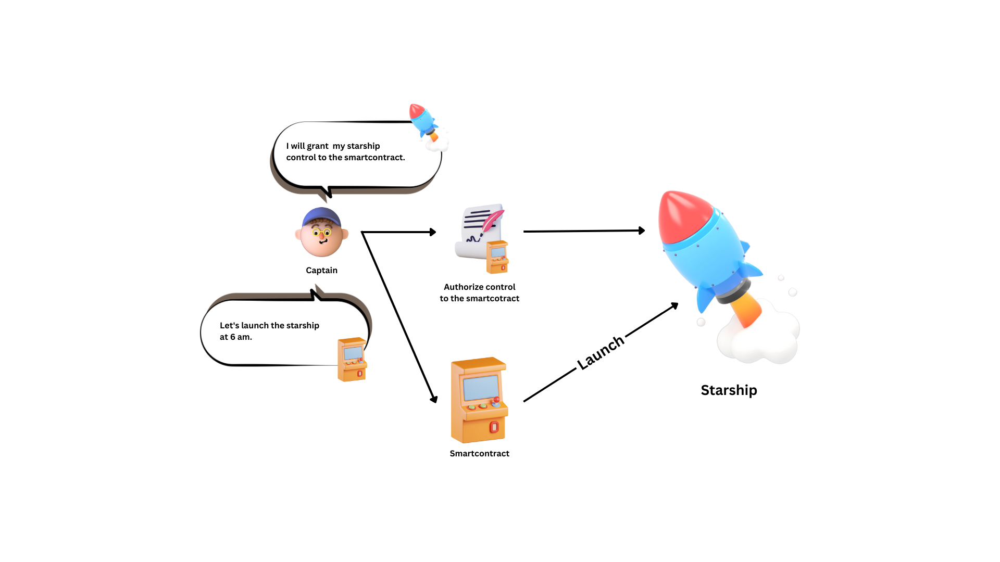

+++
tags = "evm"
date = "10 August, 2023"
+++

# Account Abstraction in Nutshell

> In this article, I will summary the history of AA development. Going through EIP-3074, EIP-2938, and EIP-4337 in simple language will hopefully give you the sense of AA.

Importantly, we must be clear that Account Abstraction is not a SOLUTION, it’s a GOAL. The goal is to answer the question “How can I interact with Ethereum without paying fee?”. Based on that primitive desire, there is a wide range of proposals trying to solve and also developing many use-cases. EIP-3074, EIP-2938, and EIP-4337 are three different approaches with their pros and cons. **THEY AIN’T INHERIT OR EXTEND EACH OTHER.**

## EIP-3074: Contract Delegation

> Propose AUTH & AUTHCALL Opcodes to the set of EVM instructions.

The proposal seems share the same fundamental of the ERC20 approve-then-transfer pattern. You may use it all the time in Uniswap. First, you need to approve the Uniswap smartcontract to transfer your token. Then, you can swap your tokens to others.

However, the ERC20-approve-then-transfer have a very limited scope within tokens transfer only. EIP-3074 wants to deploy that pattern to every possible actions on an EOA. The proposal introduce 2 new opcodes AUTH and AUTHCALL so that an EOA wallet can delegate its control to a smartcontract.

Let’s image that your boss wallet are managing everything in your company. One day, he wants some day-offs maybe for a trip, and grants you permission to run the company as well. Because everything are under his wallet, he has to share you his private key to access the wallet and co-control the company. The flaw is that once you know the private key, there is no way to revoke it.

With **Contract Delegation**, it seems easier now. Your boss will grant the root permission from his wallet to a smartcontract and set your wallet as an operator. Then, the smartcontract is playing the role of a deputy director. To run an execution, you can ask the smartcontract instead of sending a message to your boss.

> In fact, EIP-3074’s leading motivation is “sponsored transactions” when another wallet (your wallet) can pay fee instead of the permissioned wallet (your boss’ wallet)

## EIP-2938: Account Abstraction

> The first methodical attempt to Account Abstraction.

One of radical limitations in smartcontract execution is that smartcontract cannot trigger a transaction by itself. There’s always an EOA sending a transaction to call functions in the smartcontract. For example:

- Although we approved unlimited tokens for Uniswap smartcontracts from the very beginning, we still need to sign and transfer tokens for every swap transactions.
- Impossible to setup an automated monthly payroll without an EOA wallet.
- Smartcontract cannot pay transaction fees.

With EIP-2938, smartcontracts now are able to pay fees and act as an EOA wallet. Consequently, everyone can call smartcontract to trigger a transaction without fees or any on-chain interactions. The proposal is not directly solve the problem of automation like “smartcontract will pay salary monthly at a specific timestamp”. Instead, it allows an off-chain server to scheduledly call the smartcontract without fees, because the smartcontract will cover it.

> Vitalik had a great example how AA could help in Tornado Cash so I will quote it here rather than invent another example.
>
> The tornado.cash workflow is as follows:
>
> 1. A user sends a transaction to the TC contract, depositing some standard quantity of coins (eg. 1 ETH). A record of their deposit, containing the hash of a secret known by the user, is added to a Merkle tree whose root is stored in the TC contract.
> 2. When that user later wants to withdraw, they generate and send a ZK-SNARK proving that they know a secret whose hash is in a leaf somewhere in the deposit tree (without revealing where). The TC contract verifies the ZK-SNARK, and also verifies that a nullifier value (also derivable from the secret) has not yet been spent. The contract sends 1 ETH to the user’s desired address, and saves a record that the user’s nullifier has been spent.
>
> The privacy provided by TC arises because when a user makes a withdrawal, they can prove that it came from *some* unique deposit, but no one other than the user knows which deposit it came from. However, implementing TC naively has a fatal flaw: the user usually does not yet have ETH in their withdrawal address, and if the user uses their deposit address to pay for gas, that creates an on-chain link between their deposit address and their withdrawal address.
>
> Currently, this is solved via relayers; a third-party relayer verifies the ZK-SNARK and unspent status of the nullifier, publishes the transaction using their own ETH to pay for gas, and collects the fee back from the user from the TC contract.
>
> AA allows this without relayers: the user could simply send an AA transaction targeting the TC contract, the ZK-SNARK verification and the nullifier checking can be done in the verification step, and PAYGAS can be called directly after that. This allows the withdrawer to pay for gas directly out of the coins going to their withdrawal address, avoiding the need for relayers or for an on-chain link to their deposit address.

## EIP-3074 & EIP-2938’s drawbacks

To apply these 2 EIPs, a consensus-level upgrades in Ethereum protocol is required. That vital requirement created a barrier of tech complexity and needed time for implementation and testing.

Plus, they both introduce new transaction system which increase complexity for off-chain protocols to simultaneously support multiple transaction systems.

To tackle the challenge, EIP-4337 was introducing AA without adjusting the Ethereum protocol.

## EIP-4337: Account Abstraction Using Alt Mempool

Let’s image that now rather than generated a new EOA wallet for a new user, we deploy a smartcontract and send it as his/her abstract account. Every time a user interacts with the wall contract, they will send the info of the call to a new class named **Bundler** and this actor will sign, also pay fees for the actual transaction.

It’s clear that **Bundler** sign the actual transaction, users no longer need to pay fees. However, because the bundler have control the wallet contract, EIP-4337 will focus on developing higher security layer further than the pair of private key and public key. That security layer will do to things:

- Eliminate the bad motivation of bundlers and make sure that they always act right.
- Only authenticated users are able to interact with his/her wallets.

> We recognize that EIP-4337 has a similar approach as layer 2 when it introduce a new layer on top of Ethereum consensus. Bundler is similar to Sequencer. Wallet Factory contract is similar to Layer-2’s Rollup contract.

Giving a simple example of AA below will help you understand how the AA could work.

### Wallet Contract aka. Abstract Account

In this wallet, it will implements some data and functions like this:

**Owner.** The account that owns this wallet. It’s usually the a user’s EOA address.

**Bundler.** The address that is granted to directly interact with this contract.

**User Authentication.** To verify signature of the owner address.

**Calldata Execution.** To execute the desired transaction after successful authentication.

All the user’s assets will be managed in the abstract account. To execute a transaction from this wallet like swapping tokens on Uniswap for example, the user will do:

1. Compile the swap data the an object name `UserOperation`.
2. Sign on the data with his/her EOA wallet (Generate a valid signature `sig` for his/her address `addr`).
3. Send the info to a bundler.

After the bundler receive the info, the bundler will do:

1. Create a transaction to interact with the corresponding wallet contract.
2. Set her/himself as the fee payer and sign on the transaction.
3. Send the transaction the wallet contract.

When the transaction arrive the wallet contract, the contract will do:

1. Check the sender whether the **Bundler**.
2. Verify the `sig` and `addr` is from the **Owner**.
3. If all passed, run the swap transaction defined in `UserOperation`. Otherwise, revert all the transaction.

In the mining node’s perspective, the guy who actually interact with the blockchain are bundlers, so bundlers will pay fees instead of “users”.

> In the above example, users still need a EOA wallet for authentication, but in the near future, Gmail Token, Phone Verification can be alternatives.

### Bundler Motivation

The financial motivation of the bundler class is fee. These fees actually come from users but in many methods like top-up balances, ERC-20, sponsorship, etc.

## Conclusion

In this articles, I have skipped multiple details and complex concepts like `EntryPoint` contract, `Paymaster` , and many others. Most of them were low concepts of implementation, and contributed fewer insight for an intuitive overview in AA. If you are trying to look for a technical implementation of AA, highly recommend to original materials from [EIPs](https://eips.ethereum.org/).
