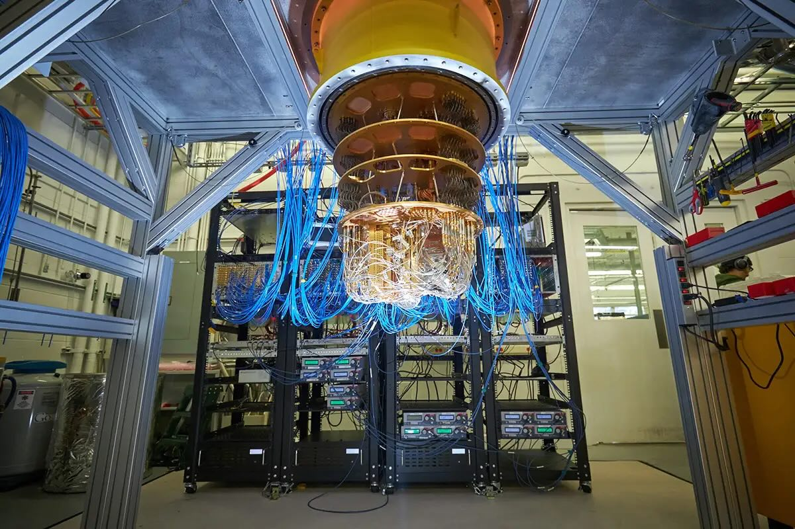

+++
tags = "cryptography, math, 🇻🇳"
date = "6 June, 2023"
+++

# Bài toán nhà tỷ phú

Bài toán gốc có tên là "A Promise and Money" và là một trong những bài toán trong cuộc thi Olympic Mật Mã - [NSUCrypto Olympiad 2019](https://nsucrypto.nsu.ru/archive/2019/round/1/section/2/task/5/#data).

## Bài toán

Một nhóm $n$ nhà nghiên cứu mật mã học trẻ đang rất hứng thú với máy tính lượng tử và mong muốn được mua một chiếc. Một nhà tỷ phú nọ hứa sẽ cho mỗi người một số tiền $X_i$ nhất định, với $i=1,...,n$. Nhưng nhà tỷ phú còn ràng buộc rằng mọi người trong nhóm không được tiết lộ số tiền của mỗi người. Hỏi làm sao để các nhà nghiên cứu biết được $X=\sum_{i=1}^n X_i$ đã đủ để mua máy tính chưa?

## Lời giải

Mỗi nhà nghiên cứu $\mathbb{X}_i$ sẽ chọn ngẫu nhiên $n$ giá trị $\{s_{ij}\}_{j=1..n}$ sao cho $\sum_{j=1}^n s_{ij} = X_i$. Sau đó, $\mathbb{X}_i$ sẽ gửi $s_{ij}$ cho $\mathbb{X}_j$, và giữ lại $s_{ij}$ nếu $i=j$. Kết thúc quá trình trao đổi, $\mathbb{X}_j$ sẽ tính toán và công bố $S_j = \sum_{i=0}^n s_{ij}$. Ta thấy điều cần chứng minh:

$$
\sum_{j=0}^n S_j = \sum_{j=0}^n \sum_{i=0}^n s_{ij} = \sum_{i=0}^n \sum_{j=0}^n s_{ij} = \sum_{i=0}^n X_i = X
$$

## Luận bàn

Trong bài toán này, ta thấy một mẫu hình rất phổ biến của Multiparty Computation (MPC) khi mà nhiều bên cùng tham gia tính toán một giá trị chung ($X$) mà không để lộ thông tin bí mật của bản thân ($X_i$). Thực vậy, bài toán tỷ phú luôn là một ví dụ dễ hiểu khi giới thiệu về MPC. Tuy nhiên, vì lời giải còn đơn giản nên chúng ta cũng nhận ra một số vấn đề trong đó.

1️⃣ Nếu nhóm chỉ có 2 nhà nghiên cứu, lời giải trên sẽ không đủ an toàn. Cụ thể, nhà nghiên cứu $\mathbb{X}_1$ sẽ có các thông tin sau toàn bộ giao thức:

$$
\begin{aligned}
S_2 &= X - S_1 \\
s_{22} &= S_2 - s_{12} \\
X_2 &= s_{21} + s_{22}
\end{aligned}
$$

2️⃣ Nếu một nhà nghiên cứu có sai sót trong tính toán và gửi kết quả sai thì sẽ dẫn đến kết quả cuối cùng cũng sẽ bị sai.

3️⃣ Nếu nhóm có càng nhiều thành viên thì quá trình trao đổi sẽ càng mất thời gian, nếu một người không thể kết nối thì giao thức cũng không thể hoàn thành.

Vì các lý do trên, một giao thức MPC để hoàn chỉnh cần nhiều yếu tố:

- Tính bảo mật (Privacy)
- Khả năng chịu lỗi (Fault Tolerance)
  - Ngưỡng chịu lỗi (Threshold)
  - Phát hiện lỗi (Verifiability)
- Tính xúc tích (Succintness)
  - Độ dài dữ iệu (Message Length)
  - Tính tương tác (Interactivity): Không tương tác là trường hợp tốt nhất (Non-Interactivity)
