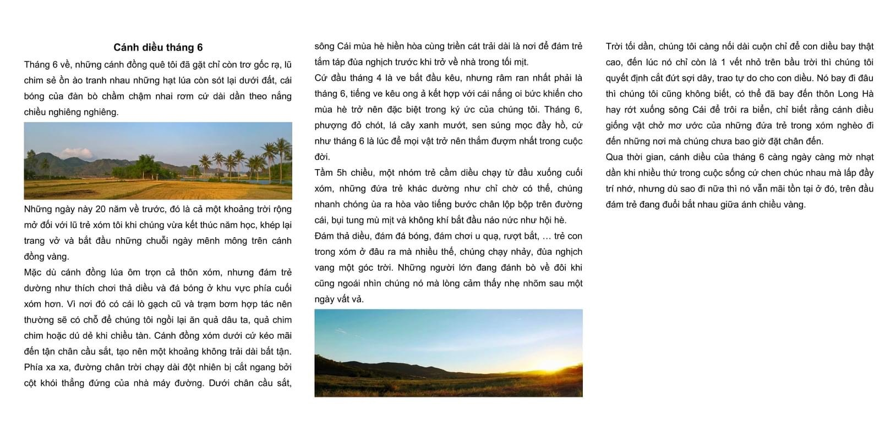

+++
tags = "tản văn, 🇻🇳"
date = "1 June, 2021"
+++

# Cánh diều tháng 6

Tháng 6 về, những cánh đồng quê tôi đã gặt chỉ còn trơ gốc rạ, lũ chim sẻ ồn ào tranh nhau những hạt lúa còn sốt lại dưới đất, cái bóng của đàn bò chầm chậm nhai rơm cứ dài dần theo nắng chiều nghiêng nghiêng.

Những ngày này 20 năm về trước, đó là cả một khoảng trời rộng mở đối với lũ trẻ xóm tôi khi chúng vừa kết thúc năm học, khép lại trang vở và bắt đầu những chuỗi ngày mênh mông trên cách đồng vàng.

Mặc dù cách đồng lúa ôm trọn cả thôn xóm, nhưng đám trẻ dường như thích chơi thả diều và đá bóng ở khu vực phía cuối cuối xóm hơn. Vì nơi đó có cái lò gạch cũ và trạm bơm hợp tác nên thường có chỗ để chúng ngồi lại ăn quả dâu ta, quả chim chim hoặc dú dẻ khi chiều tàn. Cánh đồng xóm dưới cứ kéo mãi đến tận chân cầu sắt, tạo nên một khoảng không trải dài bất tận. Phí xa xa, đường chân trời dài đột nhiên bị cắt ngang bởi cột khói trắng của nhà máy đường. Dưới chân cầu sắt, sông Cái mùa hè hiền hoà cùng triền cát dài là nơi để đám trẻ tắm táp đùa nghịch trước khi về nhà trong tối mịt.

Cứ đầu tháng 4 là ve bắt đầu kêu, nhưng râm ran nhất phải là tháng 6, tiếng ve ong ả kết hợp với cái nắng ôi bức khiến cho mùa hè trở nên đặc biệt trong ký ức của chúng tôi. Tháng 6, phượng đỏ chót, lá cây xanh mượt, sen súng mọc đầy hồ, cứ như tháng 6 là lúc để mọi vật trở nên thắm đượm nhất trong cuộc đời.

Tầm 5h chiều, một nhóm trẻ cầm diều chạy từ đầy xuống cuối xóm, những đứa trẻ khác dường như chỉ chờ có thế, chúng nhanh chóng ùa ra hoà vào tiếng bước chân lộp bộp trên đường cái, bụi tung mù mịt và không khí bắt đầu náo nức như hội hè.

Đám thả diều, đám đá bóng, đám chơi u quạ, rượt bắt, ... trẻ con trong xóm ở đâu ra mà nhiều thế, chúng chạy nhảy, đùa nghịch vang một góc trời. Những người lớn đang đánh bò về đôi khi cũng ngoái nhìn chúng nó mà lòng cảm thấy nhẹ nhõm sau một ngày vất vả.

Trời tối dần, chúng tôi càng nối dài cuộn chỉ để con diều bay thật cao, đến lúc nó chỉ còn là 1 vệt nhỏ trên bầu trời thì chúng tôi quyết định cắt đứt dây, trao tự do cho con diều. Nó bay đi đâu thì chúng tôi cũng không biết, có thể đã bay đến thông Long Hà hay rớt xuống sông Cái để trôi ra biển, chỉ biết rằng cánh diều giống vật chở mơ ước của những đứa trẻ trong xóm nghèo đi đến những nơi mà chúng chưa bao giờ đặt chân đến.

Quan thời gian, cánh diều của tháng 6 càng ngày càng mờ nhạt dần khi nhiều thứ cuộc sống cứ chen chúc nhau mà lấp đầy trí nhớ, nhưng dù sao đi nữa thì nó vẫn mãi tồn tại ở đó, trên đầu đám trẻ đang đuổi bắt nhau giữa ánh chiều vàng.

_Có lẽ là Tí viết, chỉ biết ảnh được lưu lại vào 1/6/2021_
