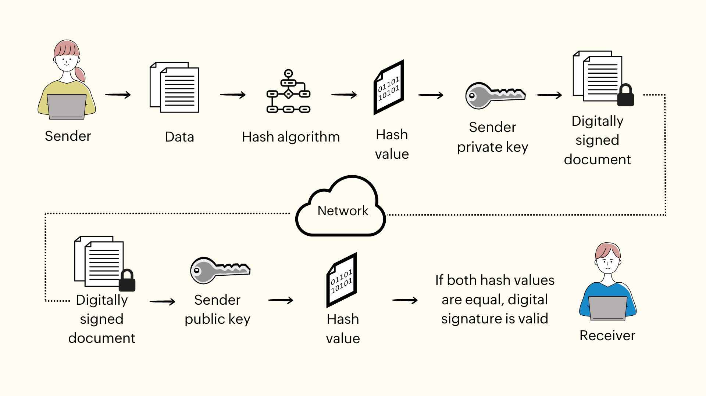

+++
tags = "cryptography, math"
date = "13 August, 2024"
+++

# Cheatsheet: Digital Signature in Web3

Digital signature algorithms are used to ensure the authenticity and integrity of digital messages or documents. Three popular digital signature algorithms are ECDSA, EdDSA, and BLS.

ECDSA is a widely used digital signature algorithm based on elliptic curve cryptography and widely adopted in well-known blockchains namely Bitcoin and Ethereum.

Schnorr Signature (EdDSA) is another digital signature algorithm also based on elliptic curve. It is designed to be faster and more secure than ECDSA. Furthermore, Schnorr signature is more friendly to multi-party computing than ECDSA.

BLS is a digital signature algorithm that uses bilinear pairings to achieve a more efficient and compact signature, which originally targets to zero-knowledge domains.

---

# ECDSA

## Key Generation

For an $EC$ of order $n$ with a generator $G$, we can randomize a $Priv$. Based on the discrete logarithm on $EC$, $Pub = Priv*G$.

## Sign

Randomize $r$ and open $R_x=[rG]_x$.

With a hash function $H$, open the signature:

$$
s = r^{-1}(H(m)+R_xPriv)
$$

## Verify

Collect $(R_x,s)$ and verify the equation:

$$
R_x \overset{?}{=} [s^{-1}(H(m)G+R_xPub)]_x
$$

---

# Schnorr (EdDSA)

## Key Generation

For an $EC$ of order $n$ with a generator $G$, we can randomize a $Priv$. Based on the discrete logarithm on $EC$, $Pub = Priv*G$.

## Sign

Randomize $r$ and open $R=rG$.

With a hash function $H$, open the signature:

$$
s = r + H(R,Pub,m)Priv
$$

## Verify

Collect $(R,s)$ and verify the equation:

$$
R \overset{?}{=} sG - H(R,Pub,m)Pub
$$

---

# BLS

## Key Generation

For an $EC$ of $(\mathbb{G},G)$, and a bilinear pairing function $e: \mathbb{G} \times \mathbb{G} \rightarrow \mathbb{G}_T$, we can randomize the $Priv$. Based on the discrete logarithm on $\mathbb{G}$, $Pub = Priv*G$.

## Sign

With a hash-to-the-curve function $H$, open the signature:

$$
s=PrivH(m)
$$

## Verify

Collect $(s,m)$ and verify the equation:

$$
e(s,G) \overset{?}{=} e(Pub,H(m))
$$
