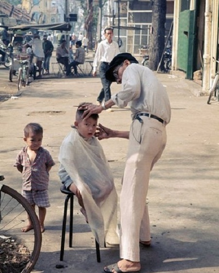

+++
tags = "tản văn, 🇻🇳"
date = "19 August, 2024"
+++

# Chuyện cắt tóc

Tôi có cậu em vẫn hay rửa xe cho tôi. Cu cậu rửa xe cẩn thận vả lại khá có duyên nên tôi vẫn thường ghé, một phần để rửa xe, phần còn lại để trò chuyện.

Mới tháng trước, cu cậu có nói "Anh à, chắc em thôi không rửa xe nữa!". Tôi cũng hơi ngạc nhiên nhưng cũng hỏi tiếp câu chuyện. Nhè ra cu cậu lâu nay học nghề cắt tóc vào các tối trong tuần, nay cứng tay cứng chân nên muốn mở tiệm riêng. Vừa được đổi đời tự doanh, nhưng theo cậu thì cái quan trọng hơn là nghề rửa xe không có tính nghệ thuật, mà ai thiếu nghệ thuật thì người đó coi như sống với chỉ một nửa linh hồn. Cuộc đời cần nghệ thuật và nghệ thuật giúp làm đẹp cho đời. Cắt một cái đầu đẹp thì vẫn nghệ hơn so với rửa một cái xe sạch, cũng vì vậy mà nghiệp cắt tóc sẽ duyên hơn với cu cậu. Tôi nghe ù ù cạc cạc nên cũng ợm ờm cho xuôi và hứa sẽ ghé ủng hộ ông chủ.

Dạo này trời nóng, tóc dài quá đâm ra bất tiện. Nhớ lời hứa với cu cậu tôi cũng thôi ghé tiệm cắt tóc và xem cậu em làm ăn sao rồi. Tiệm mới, nói chung không đông, chỉ có tôi với cu cậu là vừa đủ hai vế của kẻ bán người mua. Ngồi lên ghế, tháo kính cận cho cu cậu xử. Thường thì cắt tóc tiệm cũ họ vẫn hay yêu cầu tôi đeo kính vào kiểm tra có vừa ý không rồi mới cắt tiếp phần khác. Riêng tiệm này, ông chủ chắc giỏi và hiểu khách nên không thấy hỏi. Phần tôi tôn trọng ông chủ nên cũng không yêu cầu. Tầm nửa tiếng thì cũng xong. Ông chủ lau chùi cổ vai, phủi bớt tóc con còn vướng trên áo rồi hỏi ý kiến khách. Tôi không biết trả lời sao vì còn đang lờ mờ hiểu ra cái ý nghệ thuật mà cậu từng nhắc đến lúc còn rửa xe. Gửi tiền rồi dắt xe ra về. Trên đường, tôi đồng ý với bản thân có lẽ vì rửa xe lâu quá mà nghệ thuật trong cậu nó chết hẳn rồi, không cứu được.

