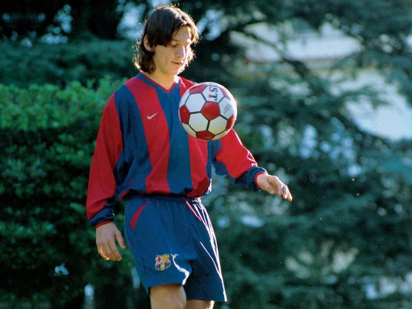

+++
tags = "tản văn, 🇻🇳"
date = "8 August, 2021"
+++

# Chuyện Messi rời Barca

Thuở thiếu thời, hắn mắc chứng nan y, người người khinh chê, không ai dung nạp. May có người xứ lạ quan sát hồi lâu, đinh ninh sau này xuất chúng bèn thu về chữa trị. Bịnh tình thuyên giảm, thiên phú bộc phát, thiếu niên đương tuổi không ai sánh bằng.

Trường niên rèn luyện, rốt cuộc cũng đến ngày dụng binh. Lần đầu so tài, hắn chẳng màng hãi, tài năng được thể phô trương, người người khâm phục, đoán định hậu vận tất chẳng thể khinh khi. Quả ắt vậy, hắn thi đến đâu, hương danh theo đến ấy. Bảng vàng thường niên, không bao giờ vắng. Ở xứ Bồ Đào Nha cũng có người tài, khởi phát từ Lý Tư Bổn, sau gây danh ở Man Triệt Tư Đặc và Mã Đức Lí. Tài nhân so tài nhân, người xem được lòng thích thú. Tuy vậy, hắn vẫn cao tay, chiếm trọn lục kim cầu, đương định thêm một nay mai.

Đến năm Tân Sửu, ngân sách lâm nguy, nội tình rối ren, tướng mới thay vẫn chưa bình ổn. Hắn bớt bổng lộc, một lòng cống hiến. Kì khôi thay, đôi bên đồng tình nhưng quan nha phá bỉnh, đặt luật khắt khe, khiến bao người bất bình nhưng không làm gì được.

Chia ly khó tránh, ngày tiễn biệt ai cũng quyến luyến. Tâm muốn ở nhưng thế chẳng đành, bèn suy tính theo hướng tích cực. Gỗ lớn khó dùng, tài nhân cần bậc hiền đức trọng dụng.

Messi là tài nhân, ở đâu cũng là tài nhân. Còn được xem Messi thi đấu ắt cũng là lẽ may mắn.

