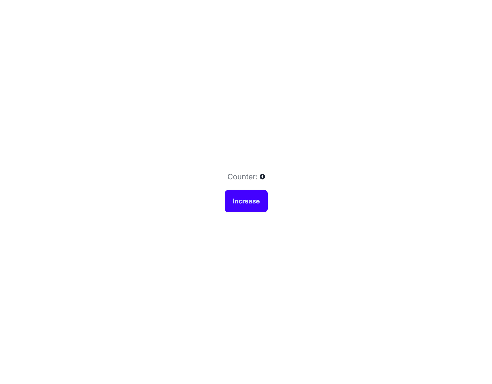

+++
tags = "web3, webdev, 🇻🇳"
date = "22 November, 2024"
+++

# Giao diện DApp

Vẻ đẹp của các Decentralized App nằm ở việc bạn có thể không cần dùng tới Backend để duy trì dịch vụ. Một giao diện được kết nối trực tiếp với Blockchain nếu được thiết kế tốt vẫn tạo ra một trải nghiệm mượt mà cho người dùng.


Trong phạm vi series, chúng ta sẽ sử dụng RemixJS để xây dựng một ứng dụng. Lý do chọn [RemixJS](https://remix.run/) thay vì [NextJS](https://nextjs.org/)? Theo quan điểm của người viết, NextJS được tạo ra theo hướng "opinionate" và phục vụ cho hạ tầng Vercel. Còn RemixJS, bản thân nó là opensource và được thiết kế để hoạt động với mọi hạ tầng.

> Điều này càng được khẳng định khi ChatGPT đã chuyển từ NextJS sang RemixJS.

## Khởi tạo RemixJS

Chúng ta sử dụng câu lệnh [create-remix](https://remix.run/docs/en/main/other-api/create-remix) với các cài đặt mặc định.

```bash
npx create-remix@latest
```

Ta được cấu trúc dự án như sau:

```bash
.
├── README.md
├── app
│   ├── entry.client.tsx
│   ├── entry.server.tsx
│   ├── root.tsx
│   ├── routes
│   │   └── _index.tsx
│   └── tailwind.css
├── node_modules
├── package.json
├── pnpm-lock.yaml
├── postcss.config.js
├── public
│   ├── favicon.ico
│   ├── logo-dark.png
│   └── logo-light.png
├── tailwind.config.ts
├── tsconfig.json
└── vite.config.ts
```

## Cài đặt DaisyUI

[DaisyUI](https://daisyui.com/) có thể xem như một superset của TailwindCSS. Thay vì phải viết các `css class` dài, DaisyUI tạo nên các `class` lớn và cho phép tái sử dụng một cách thống nhất.

```bash
pnpm add -D daisyui sass-embedded
```

Thêm DaisyUI và `tailwind.config.ts`:

```ts label="tailwind.config.ts" group="daisy"
import type { Config } from 'tailwindcss'

export default {
  content: ['./app/**/{**,.client,.server}/**/*.{js,jsx,ts,tsx}'],
  theme: {
    // ...,
    plugins: [require('daisyui')],
  },
  plugins: [],
} satisfies Config
```

Ngoài ra chúng ta cũng sẽ refactor lại các tổ chức các file `css` vào thư mục `styles`.

```bash
mkdir ./app/styles
```

Xoá file `tailwind.css`, cập nhật `app/root.ts`, và thêm `styles/index.scss` với nội dung:

> Sử dụng font mặc định `Inter`. Đối với màn hình lớn `1rem = 16px`, còn nếu màn hình nhỏ thì `1rem = 14px`.

```scss label="styles/index.scss" group="css"
@tailwind base;
@tailwind components;
@tailwind utilities;

html {
  font-family: 'Inter', sans-serif;
  font-size: 14px;
  @screen md {
    font-size: 16px;
  }
}

body {
  @apply bg-base-100;
}
```

```ts label="app/root.ts" group="css"
// ...
// REMOVE 👉 import './tailwind.css'
import '~/styles/index.scss'
// ...
```

## Khởi động ứng dụng

Thay thế nội dung file `app/routes/_index.tsx`:

```tsx label="app/routes/_index.tsx" group="init"
import type { MetaFunction } from '@remix-run/node'
import { useState } from 'react'

export const meta: MetaFunction = () => {
  return [
    { title: 'Web3 Counter' },
    {
      name: 'description',
      content:
        'Bài 5. Giao diện DApp | CS01: Dự án chuẩn công nghiệp trên Ethereum | 2024',
    },
  ]
}

export default function Index() {
  const [counter, setCounter] = useState('0')

  return (
    <div className="w-full min-h-dvh flex flex-col gap-4 items-center justify-center">
      <p>
        <span className="opacity-60">Counter: </span>
        <span className="font-black">{counter}</span>
      </p>
      <button className="btn btn-primary">Increase</button>
    </div>
  )
}
```

Chạy lệnh `pnpm dev` ta sẽ được giao diện như hình.



## Cài đặt môi trường

Ứng dụng có thể chạy trên nhiều môi trường như `test`, `staging`, hoặc `production`. Thay vì thay đổi `configs` cho từng môi trường một cách thủ công, chúng ta có thể thiết lập nhận biết môi trường tự động từ đó xuất ra bộ cài đặt phù hợp với môi trường đó.

```ts label="app/configs.ts" group="configs"
export const env = process.env.NODE_ENV

const configs: Record<typeof env, { rpc: string }> = {
  development: {
    rpc: 'https://holesky.infura.io/v3/<api_token>',
  },
  test: {
    rpc: '',
  },
  production: {
    rpc: 'https://mainnet.infura.io/v3/<api_token>',
  },
}

export default configs[env]
```

> Bạn có thể tái sử dụng Infura API ở [Bài 3. Triển khai Smartcontract](https://tuphan.dev/blog/cs01-du-an-chuan-cong-nghiep-tren-ethereum/trien-khai-smartcontract).

> Lưu ý các giá trị trong `configs` là công khai. Vì vậy, cần tránh lưu các giá trị secret ở trong `configs`.

## Sử dụng SDK

Chúng ta đã triển khai SDK ở [Bài 4](https://tuphan.dev/blog/cs01-du-an-chuan-cong-nghiep-tren-ethereum/trien-khai-sdk) và sẽ sử dụng nó để đọc giá trị biến `counter` trong bài này.

```bash
pnpm add viem cs01-2024
```

```tsx label="app/routes/_index.tsx" group="counter"
import type { MetaFunction } from '@remix-run/node'
import { ABI, ADDRESS } from 'cs01-2024'
import { useCallback, useEffect, useMemo, useState } from 'react'
import { createPublicClient, getContract, http } from 'viem'
import { holesky } from 'viem/chains'
import configs from '~/configs'

export const meta: MetaFunction = () => {
  return [
    { title: 'Web3 Counter' },
    {
      name: 'description',
      content:
        'Bài 5. Giao diện DApp | CS01: Dự án chuẩn công nghiệp trên Ethereum | 2024',
    },
  ]
}

export default function Index() {
  const [counter, setCounter] = useState('0')

  const contract = useMemo(() => {
    const publicClient = createPublicClient({
      chain: holesky,
      transport: http(configs.rpc),
    })
    return getContract({
      address: ADDRESS,
      abi: ABI,
      client: { public: publicClient },
    })
  }, [])

  const fetchCounter = useCallback(async () => {
    const counter = await contract.read.counter()
    return setCounter(counter.toString())
  }, [contract])

  useEffect(() => {
    fetchCounter()
  }, [fetchCounter])

  return (
    <div className="w-full min-h-dvh flex flex-col gap-4 items-center justify-center">
      <p>
        <span className="opacity-60">Counter: </span>
        <span className="font-black">{counter}</span>
      </p>
      <button className="btn btn-primary">Increase</button>
    </div>
  )
}
```

Kết quả sẽ được:


# Phụ lục

## Autoformat trong VSC

[🎨 Prettier - Code formatter by Prettier](https://marketplace.visualstudio.com/items?itemName=esbenp.prettier-vscode)

[❓ How do you format code on save in VS Code - Stackoverflow](https://stackoverflow.com/a/39973431/23764070)

```json label=".prettierrc.json" group="prettier"
{
  "trailingComma": "all",
  "tabWidth": 2,
  "semi": false,
  "singleQuote": true,
  "printWidth": 80
}
```
