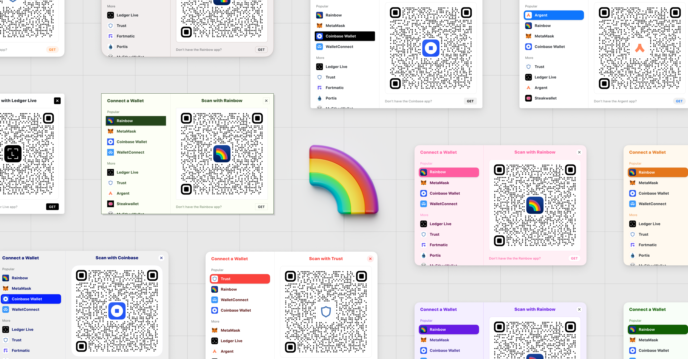

+++
tags = "web3, evm, 🇻🇳"
date = "26 November, 2024"
+++

# Kết nối ví

Theo thống kê, hiện nay có từ 300-500 ví crypto. Việc tích hợp một số lượng ví đa dạng cho DApp và bảo trì, cập nhật là rất tốn công sức. Thay vì phải làm điều này từ đầu, chúng ta có thể sử dụng các bộ kit có sẵn và không phải quan tâm quá sâu vào quá trình tích hợp ví đơn lẻ.

Có khá nhiều bộ kit ví dụ như [Rainbowkit](https://www.rainbowkit.com/), [Onchainkit](https://onchainkit.xyz/) của Coinbase, [Wallet SDK](https://portal.thirdweb.com/wallet-sdk/v2?ref=blog.thirdweb.com) của thirdweb.... Tuy nhiên, trong phạm vi bài viết chúng ta sẽ chỉ sử dụng một trong các bộ kit trên và là Rainbowkit.



## Wallet Provider

```bash
pnpm i @rainbow-me/rainbowkit wagmi @tanstack/react-query
mkdir ./app/providers
```

Tạo file `wallet.provider.tsx` trong thư mục `providers` vừa được tạo.

```tsx label="providers/wallet.provider.tsx" group="provider"
import { type ReactNode } from 'react'
import { getDefaultConfig, RainbowKitProvider } from '@rainbow-me/rainbowkit'
import { WagmiProvider } from 'wagmi'
import { mainnet, holesky } from 'wagmi/chains'
import { QueryClientProvider, QueryClient } from "@tanstack/react-query"

import '@rainbow-me/rainbowkit/styles.css';

const config = getDefaultConfig({
  appName: 'Onchain Counter',
  projectId: 'YOUR_PROJECT_ID',
  chains: [mainnet, holesky],
  ssr: true,
});
const queryClient = new QueryClient();

export default function WalletProvider({ children }: { children: ReactNode }) {
  return (
    <WagmiProvider config={config}>
      <QueryClientProvider client={queryClient}>
        <RainbowKitProvider>{children}</RainbowKitProvider>
      </QueryClientProvider>
    </WagmiProvider>
  )
}
```

> `projectId` để có thể làm việc với WalletConnect. Nếu bạn muốn hỗ trợ WalletConnect thì có thể đăng ký miễn phí `projectId` tại [WalletConnect Cloud](https://cloud.walletconnect.com/).

Thêm `WalletProvider` vào `root.tsx`

```tsx label="root.tsx" group="root"
// ...
import WalletProvider from '~/providers/wallet.provider.tsx'
// ...
export function Layout({ children }: { children: React.ReactNode }) {
  return (
    <html lang="en">
      <head>
        <meta charSet="utf-8" />
        <meta name="viewport" content="width=device-width, initial-scale=1" />
        <Meta />
        <Links />
      </head>
      <body>
        <WalletProvider>{children}</WalletProvider>
        <ScrollRestoration />
        <Scripts />
      </body>
    </html>
  )
}
// ...
```

## Connection Button

Tạo file `header.tsx` trong `app`

```tsx label="app/header.tsx" group="header"
import { ConnectButton } from '@rainbow-me/rainbowkit'

export default function Header () {
  return <div className="w-full sticky t-0 bg-base-100 p-4 flex flex-row gap-4 items-center">
    <div className="bg-slate-900 w-64 h-64 rounded-full" />
    <div className="grow">
    <ConnectButton />
  </div>
}
```