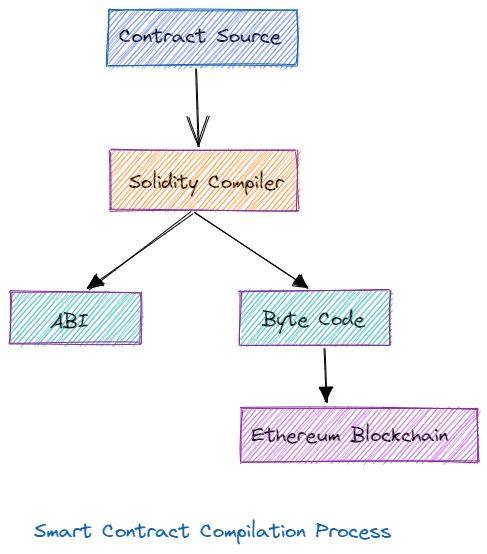

+++
tags = "web3, evm, solidity, 🇻🇳"
date = "6 November, 2024"
+++

# Smartcontract: Bộ đếm on-chain với Hardhat

Bạn có thể tăng tốc quá trình phát triển Web App với Javascript/NextJS, Web Server với Rust/Rocket.rs, Mobile App với Dash/Flutter, và cùng nguyên tắc đó ta có phát triển smartcontract với Solidity/Hardhat.

## Khởi tạo dự án

Tạo folder dự án `cs01` và cài đặt `hardhat`:

```bash
mkdir cs01
cd cs01
pnpm init
pnpm add -D hardhat
```

Khởi tạo hardhat. Lưu ý, chúng ta phải chọn `Create a TypeScript project (with Viem)` và `y` cho tất cả các cài đặt còn lại.

```bash
npx hardhat init
```

Sau khi hoàn tất, ta được cấu trúc thư mục như bên dưới:

```base
.
├── README.md
├── contracts
├── hardhat.config.ts
├── ignition
├── node_modules
├── package.json
├── pnpm-lock.yaml
├── test
└── tsconfig.json
```

Trong đó `hardhat.config.ts` là cài đặt Hardhat, thư mục `contracts` chứa code solidity, thư mục `ignition` chứa scripts triển khai contracts, và thư mục `test` để kiểm thử contracts.

Chạy thử lệnh `npx hardhat compile`,

```bash
npx hardhat compile

Compiled 1 Solidity file successfully (evm target: paris).
```

## Quan hệ giữa Smartcontract, Solidity, và ABI

Bạn sẽ phát triển smartcontract bằng Solidity và biên dịch ra mã máy bằng Solidity Compiler. Blockchain sẽ lưu trữ và thực thi mã máy này. Tuy nhiên để tương tác với smartcontract thông qua các ngôn ngữ lập trình như Javascript, Python,... chúng ta cần định nghĩa lại interface của contract một cách thủ công. Điều này được chuẩn hoá bởi Solidity Compiler bằng cách tạo ra một sản phẩm phụ mang tên ABI (Application Binary Interface) trong quá trình biên dịch. Với ABI, các ngôn ngữ lập trình có thể nhanh chóng hiểu và tương tác với smartcontract.



## Bộ đếm on-chain

> Có thể xoá contracts mẫu của hardhat, `contracts/Lock.sol`.

Chúng ta sẽ viết một smartcontract đơn giản với biến `counter` được khởi tạo bằng `0` và một hàm `increase` để tăng `+1` cho mỗi lần gọi. Đối với hàm `increase`, ta chỉ cho phép `owner` truy cập và emit một sự kiện `Increase` cho mỗi lần gọi thành công.

```bash
pnpm add @openzeppelin/contracts
```

Đối với logic contract đã được chuẩn hoá cao như `Ownership`, token `ERC20`, thư viện toán `MathSafe`,... thay vì phải viết lại cho mỗi lần phát triển dự án, sẽ an toàn hơn khi ta sử dụng `@openzeppelin/contracts`.

`@openzeppelin/contracts` là một tập hợp các contracts mẫu mực đã được kiểm thử và nâng cấp nhiều lần từ cộng đồng cũng như các công ty đầu ngành. Hiện nay, các contracts phổ biến trong `@openzeppelin/contracts` có độ tin cậy và an toàn cao.

```solidity label="Counter.sol" group="contract"
// SPDX-License-Identifier: MIT
pragma solidity ^0.8.27;

import '@openzeppelin/contracts/access/Ownable.sol';

contract Counter is Ownable {
  uint256 public counter;

  event Increase(address indexed account, uint256 counter);

  constructor() Ownable(msg.sender) {
    counter = 0;
  }

  function increase() public onlyOwner {
    counter = counter + 1;
    emit Increase(msg.sender, counter);
  }
}
```

Với contract `Counter.sol` bên trên, ta kế thừa lại login của `Ownable.sol`. Điều này cho phép ta có thể quản lý chủ của (`owner`) contract và thiết lập quyền cho các hàm mong muốn (ví dụ như `increase`).

## ABI

Nếu chạy thử `pnpm build` ta sẽ nhận ra một thư mục `artifacts` chứa các sản phẩm `bytecode` và `abi`. Vì ABI sẽ được tái sử dụng nhiều và cho cả SDK, chúng ta nên cần một thư mục riêng để chứa các ABI này.

```bash
pnpm add -D hardhat-abi-exporter
```

Thêm cài đặt cho `hardhat.config.ts`,

```ts label="" group="config"
import { readFileSync, readdirSync, writeFileSync } from 'fs'
import { join } from 'path'
import { task, type HardhatUserConfig } from 'hardhat/config'
import '@nomicfoundation/hardhat-toolbox-viem'
import 'hardhat-abi-exporter'

const abiExporterPath = './abi'

task('abi', 'Build typechain ABI').setAction(async () => {
  readdirSync(abiExporterPath)
    .filter((name) => /(\.json)$/.test(name))
    .forEach((name) => {
      const file = join(abiExporterPath, name)
      const abi = readFileSync(file, 'utf8')
      writeFileSync(
        file.replace(/(\.json)$/, '.ts'),
        abi
          .replace(/^\[/, 'export const ABI = [')
          .replace(/\]\n$/, '] as const'),
      )
    })
})

const config: HardhatUserConfig = {
  solidity: '0.8.27',
  abiExporter: {
    path: abiExporterPath,
    runOnCompile: true,
    clear: true,
    flat: true,
  },
}

export default config
```

## Thiết lập các câu lệnh làm việc

Trong `scrips` của `package.json`, thay (hoặc thêm mới) 2 lệnh `build` và `test`.

```json label="package.json" group="install"
{
  ...
  "scripts": {
    "build": "hardhat compile && hardhat abi",
    "test": "pnpm build && hardhat test"
  },
  ...
}
```

Chạy thử lệnh `build`,

```bash
pnpm build

> demo@1.0.0 build ~/Desktop/demo
> hardhat compile && hardhat abi

Compiled 1 Solidity file successfully (evm target: paris).
```

Đồng thời, ta sẽ được folder `abi` chứa tất cả các ABI cần thiết. Lưu ý, vì `abi` là sản phẩm của quá trình `build` nên hãy thêm nó vào `.gitignore`.

```text label=".gitignore" group="gitignore"
...
# Build
abi
```

# Phụ lục

## Tại sao chúng ta phải tạo các file `ts` cho ABI?

Để `viem` có thể suy diễn được `interface` của contract, `viem` cần [const assertion](https://www.typescriptlang.org/docs/handbook/release-notes/typescript-3-4.html#const-assertions). Đó là lý do tại sao ta có `as const` ở cuối các file `ts` cho ABI. Các bạn có thể bắt gặp công dụng của nó ở bài [Triển khai SDK](/blog/cs01-du-an-chuan-cong-nghiep-tren-ethereum/trien-khai-sdk).

## VSC Plugins

[🪖 Solidity by Nomic Foundation](https://marketplace.visualstudio.com/items?itemName=NomicFoundation.hardhat-solidity)

[🎨 Prettier - Code formatter by Prettier](https://marketplace.visualstudio.com/items?itemName=esbenp.prettier-vscode)

## Autoformat trong VSC

[❓ How do you format code on save in VS Code - Stackoverflow](https://stackoverflow.com/a/39973431/23764070)

```json label=".prettierrc.json" group="prettier"
{
  "trailingComma": "all",
  "tabWidth": 2,
  "semi": false,
  "singleQuote": true,
  "printWidth": 80
}
```
