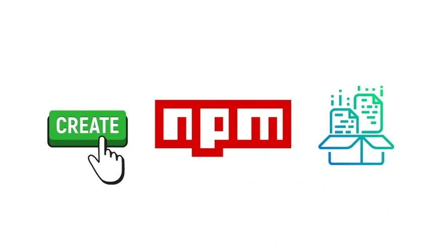

+++
tags = "web3, webdev, 🇻🇳"
date = "18 November, 2024"
+++

# Triển khai SDK

Việc gửi trực tiếp ABI cho các phòng ban ví dụ Frontend, Backend, Data Analysis để có thể tương tác với smartcontract một các thủ công sẽ dẫn đến nhiều bất tiện (Quản lý phiên bản không đồng nhất, các hàm side-effect không được chia sẻ,...). Vì vậy, việc phát triển một [npm](https://www.npmjs.com/) package sẽ tăng tốc quá trình hợp tác giữa các team.



## Cài đặt

```bash
pnpm add -D tsc-alias rimraf
```

Chúng ta sẽ thiết lập file `tsconfig.json` để hỗ trợ cả `commonjs` và `esmodule`.

> `commonjs` giúp tương thích ngược với các phiên bản cũ, trong khi đó `esmodule` giúp tận dụng các cải tiến mới như tree-shaking, lazy import...

```json label="tsconfig.json" group="ts"
{
  "compilerOptions": {
    "baseUrl": "./",
    "target": "es2020",
    "lib": ["es2020"],
    "module": "commonjs",
    "outDir": "./dist",
    "esModuleInterop": true,
    "forceConsistentCasingInFileNames": true,
    "allowSyntheticDefaultImports": true,
    "strict": true,
    "skipLibCheck": true,
    "declaration": true,
    "sourceMap": true,
    "removeComments": true,
    "resolveJsonModule": true
  },
  "include": ["index.ts", "src", "abi"],
  "exclude": ["node_modules", "dist"],
  "tsc-alias": {
    "resolveFullPaths": true
  },
  "typedocOptions": {
    "entryPoints": ["./src/index.ts"],
    "out": "docs"
  }
}
```

```json label="tsconfig.cjs.json" group="ts"
{
  "extends": "./tsconfig.json",
  "compilerOptions": {
    "outDir": "./dist/cjs"
  }
}
```

```json label="tsconfig.esm.json" group="ts"
{
  "extends": "./tsconfig.json",
  "compilerOptions": {
    "outDir": "./dist/esm",
    "module": "esnext",
    "moduleResolution": "bundler"
  }
}
```

Thay dòng `"main": "index.js",` trong `package.json` thành

```json label="package.json" group="package"
  // ...
  "main": "./dist/cjs/src/index.js",
  "module": "./dist/esm/src/index.js",
  "files": [
    "dist"
  ],
  "exports": {
    ".": {
      "require": "./dist/cjs/src/index.js",
      "import": "./dist/esm/src/index.js"
    },
    "./package.json": "./package.json"
  },
  // ...
```

Đồng thời, thêm `dist` vào `.gitignore`.

```text label=".gitignore" group="gitignore"
...
# Build
abi
dist
```

## Thiết kế SDK

Tạo file `src/index.ts` và cập nhật câu lệnh `build`

```ts label="src/index.ts" group="sdk"
export { ABI } from 'abi/Counter'
export const ADDRESS = '0x25d731D13CFd24e2B9EC02229595BE7b5d1E1d6e'
```

```json label="package.json" group="build"
{
  // ...
  "scripts": {
    "build": "hardhat compile && hardhat abi && pnpm build:cjs && pnpm build:esm",
    "build:cjs": "tsc -p ./tsconfig.cjs.json && tsc-alias -p ./tsconfig.cjs.json && echo '{\"type\":\"commonjs\"}' > ./dist/cjs/package.json",
    "build:esm": "tsc -p ./tsconfig.esm.json && tsc-alias -p ./tsconfig.esm.json && echo '{\"type\":\"module\"}' > ./dist/esm/package.json",
    "test": "pnpm build && hardhat test"
  }
  // ...
}
```

Chạy thử `npm build` ta sẽ được:

```bash
pnpm build

> cs01-2024@1.0.0 build /Users/tuphan/Desktop/cs01-2024
> hardhat compile && hardhat abi && pnpm build:cjs && pnpm build:esm

Compiled 3 Solidity files successfully (evm target: paris).

> cs01-2024@1.0.0 build:cjs /Users/tuphan/Desktop/cs01-2024
> tsc -p ./tsconfig.cjs.json && tsc-alias -p ./tsconfig.cjs.json && echo '{"type":"commonjs"}' > ./dist/cjs/package.json


> cs01-2024@1.0.0 build:esm /Users/tuphan/Desktop/cs01-2024
> tsc -p ./tsconfig.esm.json && tsc-alias -p ./tsconfig.esm.json && echo '{"type":"module"}' > ./dist/esm/package.json
```

## Xuất bản SDK

Chạy lệnh `npm publish --access public`

```bash
npm publish --access public

npm notice
npm notice 📦  cs01-2024@1.0.0
npm notice === Tarball Contents ===
npm notice 2.0kB README.md
npm notice 2.7kB dist/cjs/abi/Counter.d.ts
npm notice 2.9kB dist/cjs/abi/Counter.js
npm notice 1.9kB dist/cjs/abi/Counter.js.map
npm notice 1.7kB dist/cjs/abi/Ownable.d.ts
npm notice 1.9kB dist/cjs/abi/Ownable.js
npm notice 1.2kB dist/cjs/abi/Ownable.js.map
npm notice 20B   dist/cjs/package.json
npm notice 118B  dist/cjs/src/index.d.ts
npm notice 365B  dist/cjs/src/index.js
npm notice 176B  dist/cjs/src/index.js.map
npm notice 2.7kB dist/esm/abi/Counter.d.ts
npm notice 2.8kB dist/esm/abi/Counter.js
npm notice 1.9kB dist/esm/abi/Counter.js.map
npm notice 1.7kB dist/esm/abi/Ownable.d.ts
npm notice 1.8kB dist/esm/abi/Ownable.js
npm notice 1.2kB dist/esm/abi/Ownable.js.map
npm notice 18B   dist/esm/package.json
npm notice 118B  dist/esm/src/index.d.ts
npm notice 143B  dist/esm/src/index.js
npm notice 190B  dist/esm/src/index.js.map
npm notice 1.8kB package.json
npm notice === Tarball Details ===
npm notice name:          cs01-2024
npm notice version:       1.0.0
npm notice filename:      cs01-2024-1.0.0.tgz
npm notice package size:  3.6 kB
npm notice unpacked size: 29.5 kB
npm notice shasum:        67b2fa60bcfee167e9ab455eca2256f25a623029
npm notice integrity:     sha512-2ckxZRPHdNITt[...]iZ22jeaG3p8aA==
npm notice total files:   22
npm notice
npm notice Publishing to https://registry.npmjs.org/ with tag latest and public access
Authenticate your account at:
https://www.npmjs.com/auth/cli/b6a05909-aaed-4247-87e3-4c48ce2ef43d
Press ENTER to open in the browser...

+ cs01-2024@1.0.0
```

Lúc này ta sẽ được gói tin NPM [cs01-2024](https://www.npmjs.com/package/cs01-2024).

> Lưu ý vì tên gói tin `cs01-2024` đã được sử dụng trong ví dụ này, các bạn cần sử dụng tên khác để tránh xung đột. Để đổi tên, các bạn có thể sử giá trị `name` trong `package.json`.

# Phụ lục

## Conventional Commitment

```bash
pnpm add -D husky
```
