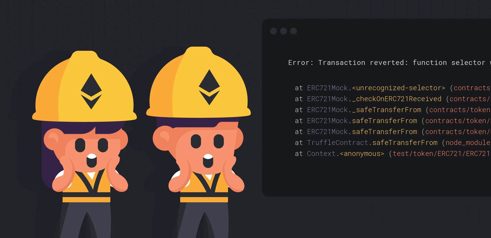

+++
tags = "evm, hardhat, 'solidity"
date = "31 August, 2024"
+++

# Debug a Smartcontract in Hardhat

To inspect a variable's value, the functions like `console.log`, or `print`, or `cout` are widely used in debugging. However, the original design of solidity have no enviroment to print out the logs, then developers used to find difficulty to understand their program's logic and errors.



Today, we will learn how to do it in Hardhat, which is a excellent framework for smartcontract development.

```solidity label="Counter.sol" group="log"
// SPDX-License-Identifier: MIT
pragma solidity ^0.8.24;

import 'hardhat/console.sol';

contract Counter {
  address public owner;
  uint256 public counter;

  constructor(uint256 init) {
    owner = msg.sender;
    counter = init;
  }

  function increase() public returns (uint256) {
    counter = counter + 1;
    console.log('Counter:', counter, 'Owner:', owner);
    console.log('Counter: %s Owner: %s', counter, owner);
    return counter;
  }
}
```

**Explanation.** The line `import 'hardhat/console.sol';` is to import a Solidity library named `console`. There exists a function name `log` in `console` so that clarify the syntax of `console.log`.

However, we cannot use it, `console.log`, to print a `bytes` variable. Instead, we must use `console.logBytes`.

```solidity label="Bytes.sol" group="logBytes"
// SPDX-License-Identifier: MIT
pragma solidity ^0.8.24;

import 'hardhat/console.sol';

contract Bytes {
  function print() public pure {
    bytes memory a = 'demo';
    console.logBytes(a);
  }
}
```

Note that the package is only helpful on `localnet`. If you're considering to debug your contracts on `testnet`, or even `mainnet`, I highly recommend to use `emit Event`, which you can find [here](https://docs.soliditylang.org/en/v0.8.26/structure-of-a-contract.html#events).
