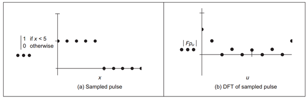

+++
tags = "math, cryptography"
date = "26 September, 2024"
+++

# Fast Fourier Transform in Efficient Polynomial Multiplication

Fast Fourier Transforms (FFT) can be used for efficient polynomial multiplication, which is particularly useful when dealing with large polynomials in several cryptography applications, for example, Shamir Secret Sharing, Multiparty Computation, Pairing-based Elliptic Curve, and many others.

## Fourier Transform ($\text{FT}$)

The Fourier Transform of a function $f(t)$ on a continuous-time domain:

$$
F(\omega) = \int_{-\infty}^{\infty} f(t) e^{-i \omega t} dt
$$

## Discrete Fourier Transform ($\text{DFT}$)

Let $x_0, ..., x_{n-1}$ be complex numbers. The Discrete Fourier Transform:

$$
X_{k=0..n-1} = \sum_{m=0}^{n-1} x_m e^{-i2 \pi km / n}
$$

where $e^{-i2 \pi k/n}$ is a primitive $n$-th root of 1 (also known as $n$-th root of unity).

> To work with points $(x,y) \in \mathbb{R}^2$ on a Cartesian coordinate, we can map $\mathbb{R}^2 \rightarrow \mathbb{C}$.

## Inverse Discrete Fourier Transform ($\text{DFT}^{-1}$)

We follow the same notation in [Discrete Fourier Transform](#discrete-fourier-transform-textdft):

$$
x_m = \frac{1}{n} \sum_{k=0}^{n-1} X_k e^{i2 \pi km/n}
$$

## Polynomial Multiplication

_Giving 2 polynomials $A(x)$ and $B(x)$ with high degrees $m$ and $n$ respectively, compute $C(x) = A(x) \times B(x)$. As we see that $|C(x)| = m + n$._

**Solution.** Let's represent polynomials as coefficient vectors $A=[a_0,a_1,...,a_{m-1}], B=[b_0,b_1,...,b_{n-1}]$, where:

$$
\begin{aligned}
A(x) &= a_0 + a_1x + a_2x^2 + ... + a_{m-1}x^{m-1}\\
B(x) &= b_0 + b_1x + b_2x^2 + ... + b_{n-1}x^{n-1}
\end{aligned}
$$

After padding zeros to the both coefficient vetors so that they're both length $N \ge n+m-1$ and $N$ is a power of 2, we can transform the padded vectors to $\text{DFT}(A) = [ A(\sigma^0), A(\sigma^1),... , A(\sigma^{n-1}) ]$ where $0 \le k \le N, \sigma = e^{-i2 \pi k/n}$ is a $n$-th root of unity, and $\text{DFT}(B)$ similarly.

Now we have the transformed vector $\text{DFT}(C)$ following:

$$
\text{DFT}(C)[k] = \text{DFT}(A)[k] \times \text{DFT}(B)[k]
$$

To compute $C$, just apply Inverse DFT to $\text{DFT}(C)$, $C = \text{DFT}^{-1}(\text{DFT}(C))$. Applying Lagrange interpolation, if you desire $C(x)$. $\qquad \blacksquare$

> To improve the efficiency, we can use Fast Fourier Transform, $\text{FFT}(A)$ and $\text{FFT}(B)$.
