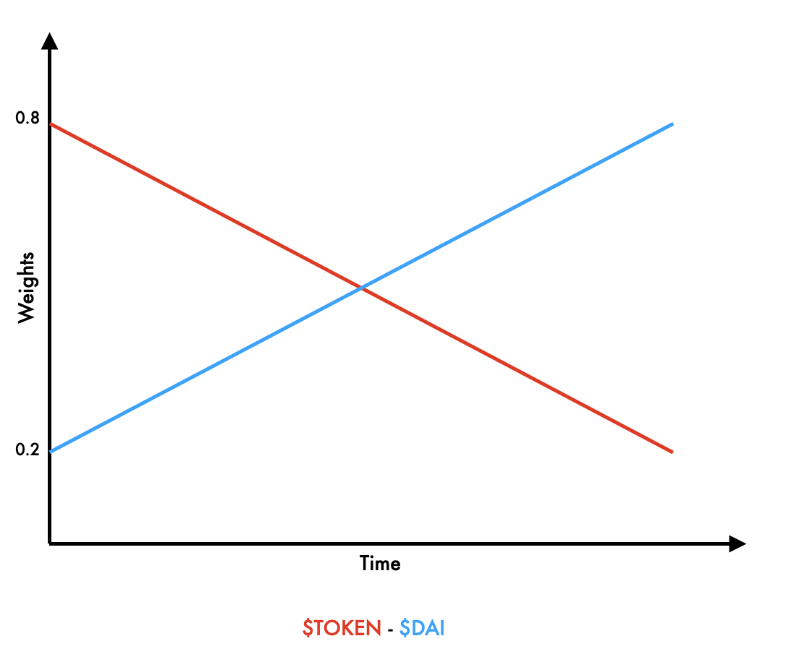

+++
tags = "web3, mba"
date = "1 October, 2024"
+++

# Leveraging Dutch Auctions for Efficient Onchain Market

In a fair market (aka. perfectly competitive market, or frictionless market), where participants can access complete information and act immediately without delay, Dutch auction is highly effective in determining the satisficing price and mitigating the impact of bots.

## How Dutch auction works?

The seller starts an item with a high price then gradually lowers the price until a buyer accepts current the price. Note that the format contrasts with the traditional auction, where the price starts low and keeps increases as a bidder competes all the others.

With a probable setup, the auction may conclude quicker than the traditional one, due to the nature of decayed price, where the equilibrium is archieved. If you, as a buyer, do not act quickly when the price is favorable, another buyer may seize the opportunity and buy the item before you.

## The Price Curve

**Linear Decay.** The price will decrease from $\text{startPrice}$ to $\text{floorPrice}$ with an invariant amount through the lifetime $d$

$$
\text{price} = \text{startPrice} - t \times \frac{\text{startPrice}-\text{floorPrice}}{d}
$$

, where $t$ is the timelapsed.

**Exponential Decay.** The price will change drastically fast at the beginning ang slow down at the price tail

$$
\text{price} = \text{startPrice} - (\text{startPrice}-\text{floorPrice}) \times e^{-\lambda t}
$$

, where $t$ is the timelapsed and $\lambda$ is the exponential decay factor.

## Onchain Aplications

### UniswapX

Dutch auction is directly metioned in [UniswapX Whitepaper](https://uniswap.org/whitepaper-uniswapx.pdf) as a core concept underpinning the cross-chain order mechanism.

### Liquidity Bootstrap Pool

Liquidity Bootstrapping Pools (LBPs) are pools that can dynamically change token weighting (e.g 1/99 to 99/1 for TokenA/TokenB). LBPs use [Weighted Math](https://docs.balancer.fi/reference/math/weighted-math.html) with time-dependent weights. By changing the weights, the pool can modify the supply relationship between the 2 in-pool tokens, then leads to the price decreasing.

### Zora - NFT Dutch Auction Platform

Multiple new NFTs are stucking in the challenge of price discovery. The artists don't know which is the best floor price to introduce thier NFTs. There is a risk that if they overprice, then the collection will lose buyer engagement. By using a Dutch auction, artists can avoid the risk of alienating buyers with a high floor price while ensuring they still get a fair market value for their NFTs.

