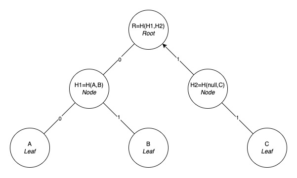
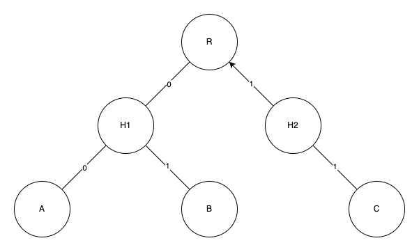
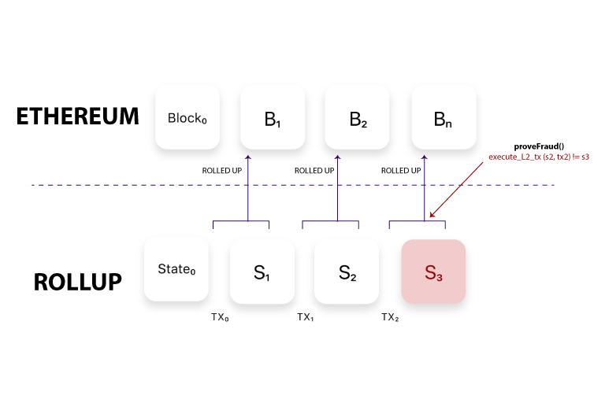

+++
tags = "cryptography, evm"
date = "20 September, 2024"
+++

# Merkle Trie: The Definition and Applications

Merkle Trie is a binary tree, where a parent node is the hash of its two children. The root is the concise proof of all leafs somehow. If a leaf updates its value, the root will change.

## Definition

**Leaf.** The most bottomm node that contains real value.

**Path.** The key in binary format that leads to the actual leaf, $(key,value)=(path,leaf)$.

**Node.** The middle nodes in the tree, its value will be the hash of the left child and the right child.

**Root.** The most top node.

### Example

Giving 3 pairs of `(key,value)` are `(0,A)`, `(1,B)`, `(3,C)` and a hash function $H$ (e.g. keccak256).



### Remark

Due to the dependency of parent to its children, the root will carry all leafs information. In the [Example](#example) above, assume the `C` changes to `D`, the `H2` will change to `H'2 = H(null,D)` cause the `R = H(H1, H'2)` root changes too.

### Code

How to build a Merkle trie in a key-value database (e.g. leveldb)?

> In Ethereum, Merkle tries are organized in key-value databases.

First we define a pairing hash like this. Because most of hash functions do not support `null` value, so we will assign a default for it, `H(null, null) = null`.

```ts label="hash.pseudo" group="hash"
function hash(left, right) {
  if (left) {
    if (right) return keccak256(concatBytes(left, right))
    else return keccak256(left)
  } else {
    if (right) return keccak256(right)
    else return null
  }
}
```

Due to [Remark](#remark), when we update a leaf value, we also have to update its parent and all ancestor nodes.

```ts label="set.pseudo" group="merkle"
function set(key /* i.e. [true, false, false, true, ...] */, value) {
  if (!key.length) return db.set([], value) // Termination: meet the root
  db.set(key, value)
  const parentPath = path.subarray(0, path.length - 1)
  const branch = path[path.length - 1]
  const sibling = db.get([...parentPath, !branch]) // flip the branch
  const left = !branch ? value : sibling
  const right = branch ? value : sibling
  const parent = hash(left, right)
  return set(parentPath, parent)
}
```

```ts label="get.pseudo" group="merkle"
function get(key /* i.e. [true, false, false, true, ...] */) {
  return db.get(key)
}
```

## Aplications

### Merkle Distribution

You want to run an 1000-receiver airdrop and the fee of sending one by one is so exspensive. However, you got a idea that you will store the list of receivers onto a smartcontract and let people claim thier tokens by themselves. Unfortunately, the list is quite long and the transaction fee to store the list is not cheap too. How we can solve this problem?

Remember that a Merkle root is a piece of concealed all leaf values. By storing just the root on-chain and releasing the whole tree data off-chain, it's sufficient to verify whether someone is eligile to claim the tokens.



Let's say $A=(receiver,amount)$, then $proof = [A, B, H2]$. The contract script will vefiry $R \overset{?}{=} H(H(A,B),H2)$ and send $A.amount$ tokens to $A.receiver$.

> Remember to store the history to avoid double-spend attack.

### Proof of Reserves

In 2022, after the bankruptcy of FTX, the community became eager for proof that centralized exchanges (CEXes) held sufficient reserves for users to withdraw their funds. In response, CEXes began publishing the Merkle root of all accounts, allowing users to independently verify their wallets.


### Rollup

Rollup is a solution to scale Ethereum. It inherits Ethereum's security and extends Ethereum's scalability. By executing transactions off-chain, Rollup proposes a valid Merkle root of the bundled transactions to an Ethereum contract and cheaply secure that piece of information on-chain.


