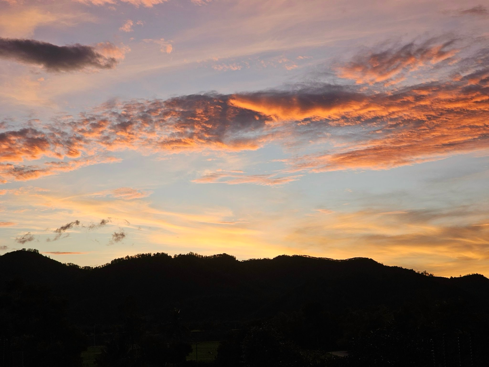
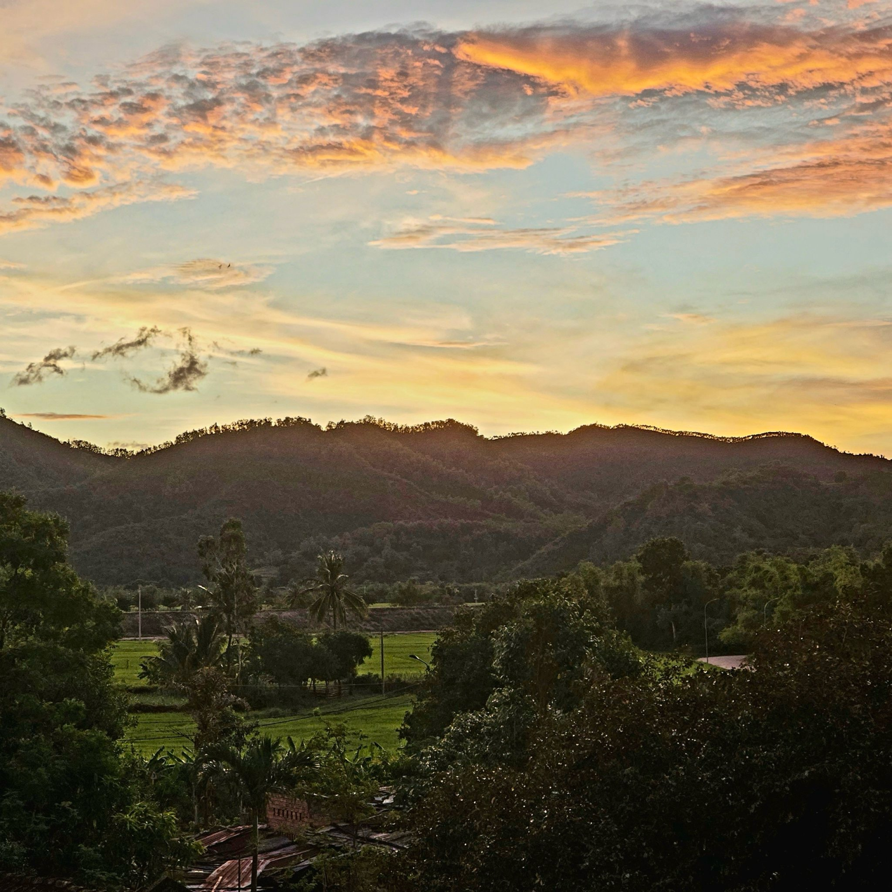

+++
tags = "tản văn, 🇻🇳"
date = "30 September, 2022"
+++

# Nhớ lắm La Hai

La Hai, phố núi hiền hòa bình dị đã đi vào nhạc, vào thơ.

La Hai xưa. Không có phố, xóm thôn chỉ có mái tranh. Hoàng hôn buông khói biếc, hàng tre xanh im lìm soi dáng xuống dòng sông. Ôi, con sông Con, sông Cái lững lờ trôi. Sông cũng ồn ào khi lũ trẻ nghịch đùa trong những buổi trưa hè oi ả.

La Hai xưa: Là vùng tự do của cuộc kháng chiến chín năm lịch sử, là nơi để người lính áo vải si ta, sau những chặng đường hành quân trải bao hiểm nguy, gian lao, vất vả trở về bên các má, các chị, các em. Rồi người lính Cụ Hồ lại đi tiếp chặng đường đánh đuổi giặc cứu dân.

La Hai xưa: Dưa Lỗ Sấu đỏ hồng, dòn tan, ngọt lịm mát lòng người chiến sĩ, trái bắp sữa đầu mùa no dạ người lính xa quê. Kẹo đậu phụng "nẫu" nấu dẻo thơm. Nồi sắn hầm ấm áp bụng đêm mưa gió. Và ai đã đến đây, dầu chỉ một lần, khi xa rồi sẽ nhớ vô cùng. Nhớ miếng dưa hấu "nẫu" trao, bắp soi Bầu má nấu, nhớ hương kẹo xứ đường, nhớ nồi sắn hầm đêm ấy hay nhớ tình người và nụ cười của em gái La Hai?

Dân gian có câu: "Nhất gái La Hai – nhì trai Phường Lụa". Em gái La Hai một lần đã gặp, khi đi xa rồi thì cứ luyến lưu.

Ai đó bảo gái La Hai xưa có mái tóc dài, hàng mi đen cong trên đôi mắt đẹp, có nụ cười tươi như hoa buổi sáng... Gái La Hai xưa cũng hay lam, hay làm, cũng hai sương một nắng để mùa về gánh lúa vàng kĩu kịt. Và nếu giặc tới, em cũng biết cầm súng giữ làng.

La Hai, La Hai quê hương! Nhiều người đã đến, đã nhớ và đã yêu, đã xem La Hai là một phần máu thịt của mình…

La Hai nay. Đã có phố, có phường; xóm xóm thôn thôn màu ngói đỏ như khoe cùng màu xanh đất trời, màu xanh của lúa. Hàng tre làng vẫn duyên dáng soi bóng. Dòng sông xanh vẫn lững lờ trôi.

Phố núi hôm nay: Ánh điện sáng lung linh trong sương. Vẫn bóng má, bóng em trên đồng. Gặp em gái La Hai, vẫn nụ cười tươi, hai má ửng hồng. Vẫn những con người một nắng hai sương điểm tô cuộc sống...

_Sưu tầm: Vũ Hoài - Báo Phú Yên Online - 30/07/2007_
