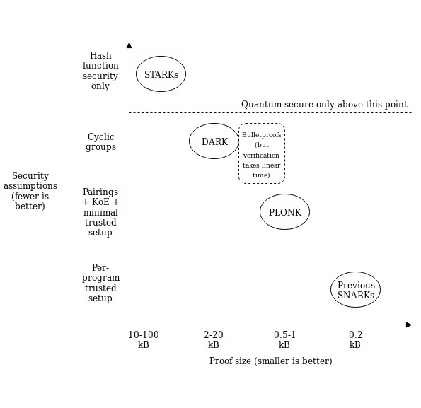

+++
tags = "cryptography, math"
date = "20 January, 2025"
+++

# Permutation Argument in Plonk

In Groth16, the witness is organized as a single vector including a public segment and a private segment. Due to this structure, one of the key tasks in Groth16 is to prove the correctness of the public segment. In contrast, Plonk organizes the witness into multiple separate vectors, which means an "output" element of one vector can be the "input" element of another vector. It's clear to see that Plonk must address the challenge of ensuring consistency between such elements across vectors. Permutation Argument or Copy Constraint is a solution to this problem.

## Contraint System

Recall that Plonk will tranform the problem into the following form:

$$
Q_{\text{Left}} a + Q_{\text{Right}} b + Q_{\text{Output}} c + Q_{\text{Multiply}} ab + Q_{\text{Constant}} = 0
$$

**Example.** You know the tuple $(x,y)$ so that $xy +7y -5 = 0$. The polynomial is equivalent to

$$
\begin{align*}
xy &= z,\\
z + 7y -5 &= 0
\end{align*}
$$

and its contraint system looks like

$$
\begin{align*}
0x + 0y - 1z + 1xy + 0 &= 0,\\
1z + 7y + 0 + 0zy - 5 &= 0. \quad \blacksquare
\end{align*}
$$

General speaking, the contraint system is a set of $n$ contraints

$$
l_i a_i + r_i b_i + o_i c_i + m_i a_i b_i + c_i = 0.
$$

Using Lagrange interpolation, the system can represent as a polynomial

$$
f(x) = l(x) a(x) + r(x) b(x) + o(x) c(x) + m(x) a(x)b(x) + c(x) = 0,
$$

which is divided by $t(x)=(x-1)...(x-n)$ (i.e. $f(x) = 0, \forall x \in \{1,...,n\}$).

The completeness and zero-knowledge in Plonk are mostly achieved by [KZG Commitment Scheme](https://scroll.io/blog/kzg). The rough protocol is depicted below.

$$
\begin{matrix}
\mathbf{P} & & \mathbf{V} \\
a(x), b(x), c(x), h(x) & \xrightarrow[]{\text{com}(a(x),b(x),c(x),h(x))} & \\
& \xleftarrow[]{\tau} & \tau \overset{\$}{\leftarrow} \mathbb{F}_q \\
& \xrightarrow[]{\text{open}(a(\tau),b(\tau),c(\tau),h(\tau))} &
  \begin{align*}
  \text{com} &\overset{?}{\sim} \text{open}\\
  f(\tau) &\overset{?}{=} h(\tau)t(\tau)
  \end{align*} \\
\end{matrix}
$$

where $\text{Com}(\cdot)$ is the KZG commitment and $h(x) = f(x)/t(x)$.

However, the soundness is relied on the [Permutation Argument](#permutation-argument).

## Permutation Argument

**Grand Product**. Giving a vector $\mathbf{v}$ and two random $\beta$ and $\gamma$, we define $f(x) = v_i + i\beta + \gamma$, $g(x) = v_i + \sigma(i)\beta + \gamma$. If $\sigma(\mathbf{v})$ is a correct permutation of $\mathbf{v}$, the grand product is equal to 1.

$$
\prod_{i=1}^{3n} \frac{f(i)}{g(i)} = 1.
$$

**Example.** First, we concate vectos $\mathbf{a},\mathbf{b},\mathbf{c}$ into a single vector $\mathbf{v} = \{a_1,\textcolor{green}{a_2},b_1,b_2,\textcolor{blue}{c_1},c_2\}$. Let's say the output of the first circuit is the left input of the sencond circuit, $\textcolor{blue}{c_1} = \textcolor{green}{a_2}$. Proving $\textcolor{blue}{c_1} = \textcolor{green}{a_2}$ is equivalent to $\mathbf{v} = \sigma(\mathbf{v})$ where $\sigma(\mathbf{v}) = \{a_1,\textcolor{blue}{c_1},b_1,b_2,\textcolor{green}{a_2},c_2\}$.

Let's rewrite the example to $\mathbf{v} = \{v_1,\textcolor{green}{v_2},v_3,v_4,\textcolor{blue}{v_5},v_6\}$ then $\sigma(\mathbf{v}) = \{v_1,\textcolor{blue}{v_5},v_3,v_4,\textcolor{green}{v_2},v_6\}$. The grad product is

$$
\frac{(v_1 + 1\beta + \gamma)\textcolor{green}{(v_2 + 2\beta + \gamma)}(v_3 + 3\beta + \gamma)(v_4 + 4\beta + \gamma)\textcolor{blue}{(v_5 + 5\beta + \gamma)}(v_6 + 6\beta + \gamma)}{(v_1 + 1\beta + \gamma)\textcolor{blue}{(v_5 + 2\beta + \gamma)}(v_3 + 3\beta + \gamma)(v_4 + 4\beta + \gamma)\textcolor{green}{(v_2 + 5\beta + \gamma)}(v_6 + 6\beta + \gamma)} = 1
$$

Because $\textcolor{green}{v_2}=\textcolor{blue}{v_5}$, it's clear to see that

$$
\begin{align*}
\textcolor{green}{(v_2 + 2\beta + \gamma)} &= \textcolor{blue}{(v_5 + 2\beta + \gamma)},\\
\textcolor{blue}{(v_5 + 5\beta + \gamma)} &= \textcolor{green}{(v_2 + 5\beta + \gamma)}. \quad \blacksquare
\end{align*}
$$
