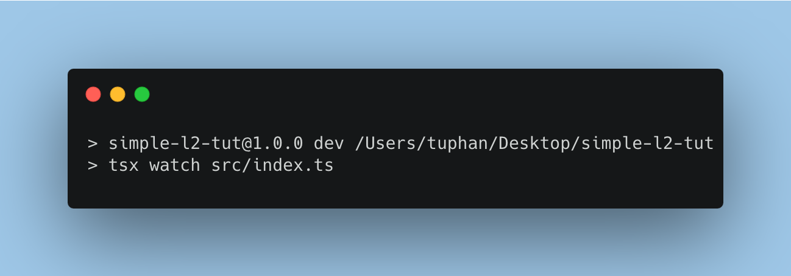

+++
tags = "layer2"
date = "28 September, 2024"
+++

# Simple Layer2 Tutorial

In this series, we will learn how to build a very simple Layer 2 based on the ideas of Optimistic Rollup (aka. OP Stack). Thought it's simple, we still learn the core concepts of a layer 2.

# Prerequisite

Cause it's quick to implement things in Javascript, so we will choose JS to build a p2p network too.

```bash label="npm" group="install"
mkdir simple-l2-tut
cd simple-l2-tut
npm i -D typescript
npx tsc --init
```

```bash label="yarn" group="install"
mkdir simple-l2-tut
cd simple-l2-tut
yarn add -D typescript
npx tsc --init
```

```bash label="pnpm" group="install"
mkdir simple-l2-tut
cd simple-l2-tut
pnpm add -D typescript
npx tsc --init
```

Personally, I would like to setup `.prettierrc.json` for auto-indent when saving in VSC. And also `.gitignore` for git. Feel free to skip it.

```json label=".prettierrc.json" group="prettier"
{
  "trailingComma": "all",
  "tabWidth": 2,
  "semi": false,
  "singleQuote": true,
  "printWidth": 80
}
```

```text label=".gitignore" group="git"
.DS_Store
node_modules
dist
.env
.env.*
!.env.example
```

Next, create an entrypoint for the whole project.

```bash label="npm" group="setup"
mkdir src
touch src/index.ts
npm i -D tsx
```

```bash label="yarn" group="setup"
mkdir src
touch src/index.ts
yarn add -D tsx
```

```bash label="pnpm" group="setup"
mkdir src
touch src/index.ts
pnpm add -D tsx
```

Finally, add `dev` script to `package.json` and test it.

```json label="package.json" group="package.json"
{
  "name": "simple-l2-tut",
  "version": "1.0.0",
  "description": "",
  "main": "index.js",
  "scripts": {
    "dev": "tsx watch src/index.ts",
    "test": "echo \"Error: no test specified\" && exit 1"
  },
  "keywords": [],
  "author": "",
  "license": "ISC",
  "devDependencies": {
    "tsx": "^4.19.1",
    "typescript": "^5.6.2"
  }
}
```

Run

```bash label="npm" group="run"
npm run dev
```

```bash label="yarn" group="run"
yarn dev
```

```bash label="pnpm" group="run"
pnpm dev
```



# Table of Contents

1. [P2P Network](/blog/simple-l2-tutorial/part-1-p2p-network)
2. [Layer 2 Contracts & Bridge Implementation](/blog/simple-l2-tutorial/part-2-layer-2-contract-bridge-implementation)
3. [State Trie & Block Proposer](/blog/simple-l2-tutorial/part-3-state-trie-block-proposer)
4. [Fraud Proof](/blog/simple-l2-tutorial/part-4-fraud-proof)
