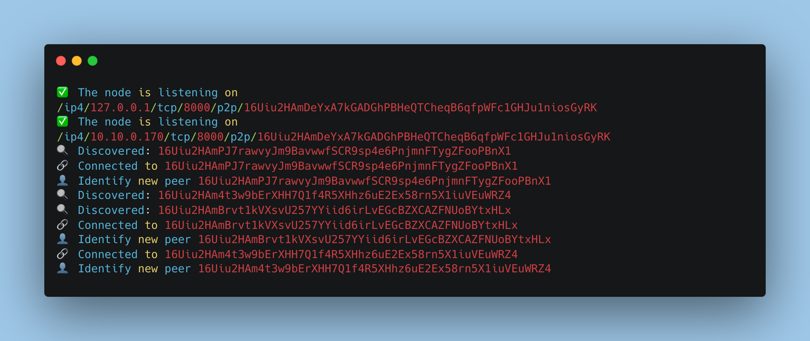
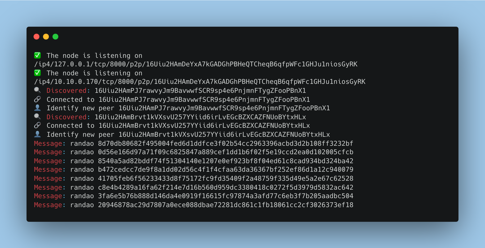

+++
tags = "layer2"
date = "28 September, 2024"
+++

# Part1: P2P Network

In a dencentralized network, nodes (aka. peers) connect directly to thier neightbours. They communicate through a complicated network graph and don't reply on any central server. In this tutorial, we will build a p2p network.

## Env

Install `dotenv` and `zod` to read the env vars.

```bash label="npm" group="install-env"
npm i dotenv zod
```

```bash label="yarn" group="install-env"
yarn add dotenv zod
```

```bash label="pnpm" group="install-env"
pnpm add dotenv zod
```

Create a file `src/config.ts`,

```ts label="src/config.ts" group="config"
import 'dotenv/config'
import { z } from 'zod'

const config = z
  .object({
    PRIVATE_KEY: z.string().optional(),
  })
  .parse(process.env)

export const { PRIVATE_KEY } = config
```

Now we creat a file `.env` in the root directory.

```txt label=".env" group="env"
PRIVATE_KEY=dummy
```

The private key here is the same format of Metamask private key or any Ethereum wallets.

## Install `libp2p`

We will use `libp2p` and its type defs `@libp2p/interface` to build this project.

```bash label="npm" group="install-libp2p"
npm i libp2p
npm i -D @libp2p/interface
```

```bash label="yarn" group="install-libp2p"
yarn add libp2p
yarn add -D @libp2p/interface
```

```bash label="pnpm" group="install-libp2p"
pnpm add libp2p
pnpm add -D @libp2p/interface
```

## Private Key

In our network, a node will be identified by its keypair including 1 privkey and 1 pubkey. In order to load one from `PRIVATE_KEY`, we will use `@libp2p/crypto`.

```bash label="npm" group="install-privkey"
npm i @libp2p/crypto
```

```bash label="yarn" group="install-privkey"
yarn add @libp2p/crypto
```

```bash label="pnpm" group="install-privkey"
pnpm add @libp2p/crypto
```

```ts label="src/index.ts" group="privkey"
import { keys } from '@libp2p/crypto'

import { PRIVATE_KEY } from './config'

const privkey = keys.privateKeyFromRaw(Buffer.from(PRIVATE_KEY, 'hex'))
```

## Swarm Behavior

```bash label="npm" group="install-behavior"
npm i @libp2p/tcp @chainsafe/libp2p-yamux @chainsafe/libp2p-noise @libp2p/identify @chainsafe/libp2p-gossipsub @libp2p/mdns
```

```bash label="yarn" group="install-behavior"
yarn add @libp2p/tcp @chainsafe/libp2p-yamux @chainsafe/libp2p-noise @libp2p/identify @chainsafe/libp2p-gossipsub @libp2p/mdns
```

```bash label="pnpm" group="install-behavior"
pnpm add @libp2p/tcp @chainsafe/libp2p-yamux @chainsafe/libp2p-noise @libp2p/identify @chainsafe/libp2p-gossipsub @libp2p/mdns
```

| Package                       | To                                                                   |
| ----------------------------- | -------------------------------------------------------------------- |
| `@libp2p/tcp`                 | Transport                                                            |
| `@chainsafe/libp2p-yamux `    | Stream multiplexer to achieve a vitrual bidirectional message stream |
| `@chainsafe/libp2p-noise`     | Secure messages through the channels                                 |
| `@libp2p/identify`            | Discover others' multiaddr and Broadcast the multiaddr itself        |
| `@libp2p/kad-dht`             | Kademlia Hash Table for Discovery protocol                           |
| `@libp2p/bootstrap`           | Maintain bootstrap peers                                             |
| `@chainsafe/libp2p-gossipsub` | Pubsub protocol                                                      |

```ts label="src/swarm.ts" group="swarm"
import { createLibp2p, type Libp2p } from 'libp2p'
import { type PubSub, type PrivateKey } from '@libp2p/interface'
import { tcp } from '@libp2p/tcp'
import { yamux } from '@chainsafe/libp2p-yamux'
import { noise } from '@chainsafe/libp2p-noise'
import {
  type Identify,
  identify,
  type IdentifyPush,
  identifyPush,
} from '@libp2p/identify'
import { gossipsub, type GossipsubEvents } from '@chainsafe/libp2p-gossipsub'
import { type KadDHT, kadDHT, passthroughMapper } from '@libp2p/kad-dht'
import { bootstrap } from '@libp2p/bootstrap'

import { PORT } from './config'

export type SwarmProps = Libp2p<{
  identify: Identify
  identifyPush: IdentifyPush
  pubsub: PubSub<GossipsubEvents>
  dht: KadDHT
}>

export default class Swarm {
  constructor(public readonly swarm: SwarmProps) {
    // Start
    this.swarm.addEventListener('start', () => {
      swarm.getMultiaddrs().forEach((addr) => {
        console.log('✅ The node is listening on', addr.toString())
      })
    })
    // Discovery
    this.swarm.addEventListener('peer:connect', ({ detail: peer }) => {
      console.log('🔗 Connected to', peer.toString())
    })
    this.swarm.addEventListener('peer:discovery', async ({ detail }) => {
      console.log('🔍 Discovered:', detail.id.toString())
    })
    this.swarm.addEventListener('peer:identify', ({ detail }) => {
      console.log('👤 Identify new peer', detail.peerId.toString())
    })
    this.swarm.addEventListener('peer:disconnect', ({ detail }) => {
      console.log('💔 Disconnected to', detail.toString())
    })
    // Stop
    this.swarm.addEventListener('stop', () => {
      console.log('⛔️ The node is terminated')
    })
  }

  static new = async <E extends PrivateKey>(privateKey: E) => {
    const swarm = await createLibp2p({
      start: false,
      privateKey,
      addresses: {
        listen: [`/ip4/0.0.0.0/tcp/${PORT}`],
      },
      transports: [tcp()],
      streamMuxers: [yamux()],
      connectionEncrypters: [noise()],
      peerDiscovery: [
        bootstrap({
          list: [
            '/ip4/13.238.141.54/tcp/8000/p2p/16Uiu2HAmPJ7rawvyJm9BavwwfSCR9sp4e6PnjmnFTygZFooPBnX1',
          ],
        }),
      ],
      services: {
        identify: identify(),
        identifyPush: identifyPush(),
        pubsub: gossipsub(),
        dht: kadDHT({
          clientMode: false,
          peerInfoMapper: passthroughMapper, // TODO: accept staker address only
        }),
      },
    })
    return new Swarm(swarm)
  }
}
```

## Kickoff the Network

We've included a brief custom in the code. When running the node, we want to operate it in `server` mode. While this does use up some CPU and storage, it will improve peer discovery, ultimately strengthening the network. Now, we're ready to launch the network.

```ts label="src/index.ts" group="start"
import { keys } from '@libp2p/crypto'

import { PRIVATE_KEY } from './config'
import Swarm from './swarm'

async function main() {
  const privkey = keys.privateKeyFromRaw(Buffer.from(PRIVATE_KEY, 'hex'))
  const { swarm } = await Swarm.new(privkey)
  await swarm.services.dht.setMode('server')
  await swarm.start()
}
main()
```

Run and you will get the result

```bash
pnpm dev
```



## Send Messages

In this step, the peers will exchange a random 32-byte message with each other using the `randao` topic by ~10s intervals.

```ts label="src/index.ts" group="message"
async function main() {
  ...
  const topic = 'randao'
  swarm.services.pubsub.subscribe(topic)
  swarm.services.pubsub.addEventListener('message', ({ detail }) => {
    console.log(
      'Message:',
      detail.topic,
      Buffer.from(detail.data).toString('hex'),
    )
  })

  setInterval(async () => {
    const ok = swarm.services.pubsub.getSubscribers(topic).length
    if (ok) swarm.services.pubsub.publish(topic, randomBytes(32))
  }, Math.ceil(10000 * Math.random()))
}
```



## Summary

In this article, we configured network behavior using `libp2p-js` to establish peer connections. To verify the connection, we also enabled the peers to exchange messages
