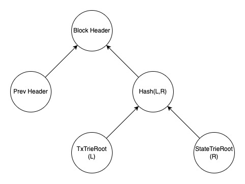

+++
tags = "layer2"
date = "5 October, 2024"
+++

# Part 2: Layer 2 Contract & Bridge Implementation

In this lesson, we will create a contract that serves two primary purposes:

1. Lock and unlock ETH on Layer 1, allowing nodes to mint or burn tokens on Layer 2 based on these actions.
2. Receive and store the sequence of block headers from Layer 2.

```solidity label="Rollup.sol" group="contract"
// SPDX-License-Identifier: UNLICENSED
pragma solidity ^0.8.24;

struct Block {
  bytes32 prev;
  uint256 timestamp;
}

struct Tx {
  address from;
  address to;
  uint256 amount;
  bytes32 witness;
}

contract Rollup {
  bytes32 public latest =
    0xab2344d27f94c1e4753f34becf3bbe88aea4caf33c2380c85b4e4ef6f286e6d1;
  mapping(bytes32 root => Block block) chain;
  mapping(address account => mapping(bytes32 root => bool unlocked)) unlocks;

  modifier unlockable(bytes32 header) {
    require(!unlocks[msg.sender][header], 'Already unlocked.');
    require(
      chain[header].timestamp + 60 < block.timestamp,
      'Still in the challenge window.'
    );
    _;
    unlocks[msg.sender][header] = true;
  }

  modifier referable(bytes32 root, bytes32 prev) {
    require(prev == latest, 'Invalid latest block.');
    _;
    latest = root;
  }

  event Lock(address indexed account, uint256 amount);
  event Unlock(address indexed account, uint256 amount);
  event Propose(
    address indexed account,
    bytes32 indexed root,
    bytes32 indexed prev
  );

  function lock() public payable {
    emit Lock(msg.sender, msg.value);
  }

  function unlock(
    uint256 amount,
    bytes32[] calldata proof
  ) public unlockable(proof[proof.length - 1]) {
    // Merkle proof here
    payable(msg.sender).transfer(amount);
    emit Unlock(msg.sender, amount);
  }

  function propose(
    bytes32 root,
    bytes32 prev,
    Tx[] calldata txs
  ) public referable(root, prev) {
    chain[root] = Block({prev: prev, timestamp: block.timestamp});
    emit Propose(msg.sender, root, prev);
  }
}
```

```json label="Rollup.json" group="contract"
[
  {
    "anonymous": false,
    "inputs": [
      {
        "indexed": true,
        "internalType": "address",
        "name": "account",
        "type": "address"
      },
      {
        "indexed": false,
        "internalType": "uint256",
        "name": "amount",
        "type": "uint256"
      }
    ],
    "name": "Lock",
    "type": "event"
  },
  {
    "anonymous": false,
    "inputs": [
      {
        "indexed": true,
        "internalType": "address",
        "name": "account",
        "type": "address"
      },
      {
        "indexed": true,
        "internalType": "bytes32",
        "name": "root",
        "type": "bytes32"
      },
      {
        "indexed": true,
        "internalType": "bytes32",
        "name": "prev",
        "type": "bytes32"
      }
    ],
    "name": "Propose",
    "type": "event"
  },
  {
    "anonymous": false,
    "inputs": [
      {
        "indexed": true,
        "internalType": "address",
        "name": "account",
        "type": "address"
      },
      {
        "indexed": false,
        "internalType": "uint256",
        "name": "amount",
        "type": "uint256"
      }
    ],
    "name": "Unlock",
    "type": "event"
  },
  {
    "inputs": [],
    "name": "latest",
    "outputs": [
      {
        "internalType": "bytes32",
        "name": "",
        "type": "bytes32"
      }
    ],
    "stateMutability": "view",
    "type": "function"
  },
  {
    "inputs": [],
    "name": "lock",
    "outputs": [],
    "stateMutability": "payable",
    "type": "function"
  },
  {
    "inputs": [
      {
        "internalType": "bytes32",
        "name": "root",
        "type": "bytes32"
      },
      {
        "internalType": "bytes32",
        "name": "prev",
        "type": "bytes32"
      },
      {
        "components": [
          {
            "internalType": "address",
            "name": "from",
            "type": "address"
          },
          {
            "internalType": "address",
            "name": "to",
            "type": "address"
          },
          {
            "internalType": "uint256",
            "name": "amount",
            "type": "uint256"
          },
          {
            "internalType": "bytes32",
            "name": "witness",
            "type": "bytes32"
          }
        ],
        "internalType": "struct Tx[]",
        "name": "txs",
        "type": "tuple[]"
      }
    ],
    "name": "propose",
    "outputs": [],
    "stateMutability": "nonpayable",
    "type": "function"
  },
  {
    "inputs": [
      {
        "internalType": "uint256",
        "name": "amount",
        "type": "uint256"
      },
      {
        "internalType": "bytes32[]",
        "name": "proof",
        "type": "bytes32[]"
      }
    ],
    "name": "unlock",
    "outputs": [],
    "stateMutability": "nonpayable",
    "type": "function"
  }
]
```

## Submit Block Headers

Because a block is produced through the Layer 2 consensus, all nodes agree on a valid submitter and the bundled transactions. As a result, the block header serves as proof of this information.



Given a hash function $H$:

$$
\begin{aligned}
&\text{blockHeader} = H(\\
&\quad \text{prevBlockHeader},\\
&\quad H(TxTrieRoot, StateTrieRoot)\\
&)
\end{aligned}
$$

Then, it's possible to provide a strong proof of relationship among the previous state, the transactions, and the next state that is valid to a given block header.

> To learn about [Merkle Trie](/blog/merkle-trie-the-definition-and-applications)
