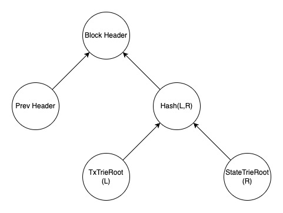

+++
tags = "layer2"
date = "12 October, 2024"
+++

# Part 3: State Trie & Block Proposer

A block header contains the information of previous block header, the transaction trie, and the state trie. Because the tries are Merkle, then the block header becomes a strong proof for security. Based on the validation, the transaction trie and the state trie can be stored offchain.

[@preview](https://github.com/tuphan-dn/simple-l2-tut/tree/p3)

## Trie

We implement a Merkle trie, where values are stored in the leaf nodes, and the key determines the path to these nodes. Each ancestor node contains the hash of its children, computed as $H(L,R)$. On every leaf update, all its accestors must also be updated.

> To learn about [Merkle Trie](/blog/merkle-trie-the-definition-and-applications)

```ts label="trie.ts" group="merkle"
import { type Level } from 'level'
import { keccak256 } from 'ethereum-cryptography/keccak'
import { concatBytes, hexToBytes } from 'ethereum-cryptography/utils'
import { bytesToBigInt } from 'viem'

export const bigintToBytes = (bn: bigint) => {
  const hex = bn.toString(16).padStart(64, '0')
  return hexToBytes(hex)
}

export const bytesToBinary = (buffer: Uint8Array) => {
  return bytesToBigInt(buffer)
    .toString(2)
    .padStart(buffer.length * 8, '0')
    .split('')
    .map((e) => e === '1')
}

export const hash = ({
  left,
  right,
}: {
  left?: Uint8Array
  right?: Uint8Array
}) => {
  if (left) {
    if (right) return keccak256(concatBytes(left, right))
    else return keccak256(left)
  } else {
    if (right) return keccak256(right)
    else return undefined
  }
}

export default class Trie {
  constructor(
    public readonly state: Level<boolean[], Uint8Array>,
    public readonly init: Array<{ key: boolean[]; value: Uint8Array }> = [],
  ) {}

  put = async (key: boolean[], value?: Uint8Array): Promise<void> => {
    if (!value) await this.state.del(key)
    else this.state.put(key, value)
    if (!key.length) return
    const [bit, ...rest] = key
    const sibling = await this.get([!bit, ...rest])
    const parent = !bit
      ? hash({ left: value, right: sibling })
      : hash({ left: sibling, right: value })
    return await this.put(rest, parent)
  }

  get = async (key: boolean[]) => {
    try {
      const re = await this.state.get(key)
      return Uint8Array.from(re)
    } catch (er: any) {
      if (er.code !== 'LEVEL_NOT_FOUND') throw er
      return undefined
    }
  }

  clear = async () => {
    await this.state.clear()
  }

  root = async () => {
    return await this.get([])
  }

  prove = async (key: boolean[]): Promise<Array<Uint8Array | undefined>> => {
    const relatives = async (
      key: boolean[],
    ): Promise<Array<Uint8Array | undefined>> => {
      if (!key.length) return []
      const [bit, ...rest] = key
      return [await this.get([!bit, ...rest]), ...(await relatives(rest))]
    }
    const value = await this.get(key)
    return [value, ...(await relatives(key))]
  }

  verify = async (
    key: boolean[],
    proof: Array<Uint8Array | undefined>,
  ): Promise<boolean> => {
    if (key.length + 1 !== proof.length || !proof.length) return false
    if (proof.length === 1)
      return proof[0]?.toString() === (await this.root())?.toString()
    const bit = key.shift()
    const a = proof.shift()
    const b = proof.shift()
    const p = hash({ left: !bit ? a : b, right: !bit ? b : a })
    return this.verify(key, [p, ...proof])
  }

  reset = async () => {
    await this.state.clear()
    for (const { key, value } of this.init) await this.put(key, value)
  }
}
```

From the general class of `Trie` above, we implement `transaction` trie and `state` trie.

```ts label="tx.ts" group="trie"
import Trie, { bigintToBytes } from './trie'

// Append to the trie.ts in Part 2
export const txTrie = new Trie(
  new Level<boolean[], Uint8Array>('data/txs-trie', {
    keyEncoding: 'buffer',
    valueEncoding: 'buffer',
  }),
)
```

```ts label="state.ts" group="trie"
import { Level } from 'level'
import { zeroAddress } from 'viem'
import { hexToBytes } from 'ethereum-cryptography/utils'
import Trie, { bigintToBytes, bytesToBinary } from './trie'

export const stateTrie = new Trie(
  new Level<boolean[], Uint8Array>('data/state-trie', {
    keyEncoding: 'buffer',
    valueEncoding: 'buffer',
  }),
  [
    {
      key: bytesToBinary(hexToBytes(zeroAddress.substring(2))),
      value: bigintToBytes(BigInt('1000000000000000000000000000')),
    },
  ],
)
```

> Note that the genesis state must be 1,000,000,000 ETH to the zero address.

## Block Headers

Because a block is produced through the Layer 2 consensus, all nodes agree on a valid submitter and the bundled transactions. As a result, the block header serves as proof of this information.



Given a hash function $H$:

$$
\begin{aligned}
&\text{blockHeader} = H(\\
&\quad \text{prevBlockHeader},\\
&\quad H(TxTrieRoot, StateTrieRoot)\\
&)
\end{aligned}
$$

Then, it's possible to provide a strong proof of relationship among the previous state, the transactions, and the next state that is valid to a given block header.

## Block Proposer

Due to the simplicity, we implement a `sequencer.ts` that plays 3 roles:

**Sequencer.** Collect and bundle tranactions from the transaction pool for Block Proposer. Sync new blocks and update the local state.

**Block Proposer.** Join the consensus and propose new blocks.

**EVM.** Validate and execute finalized transactions.

### Simple consensus with randomized timeouts

To decide who is eligible to propose a new block, we design a consensus where each participant is assigned a random clock time. The first participant to reach their timeout is eligible to propose the new block.

The transactions for a new block must be carefully validated that it's NOT included in the transaction trie yet.

### Propose

After having a block of bundled transactions, you must execute them on your local states to compute the next block header (i.e., the global trie root). Then, submit it along with the bundled transactions.

Note that while your proposal is not yet confirmed on Layer 1, it’s acceptable for other nodes to reach their timeout and submit another block. At that point, you're in a race condition, meaning the first block accepted by Layer 1 will be considered valid, regardless of the previous proposals.

In that case, others node will start sync the new state. And you, who executed a wrong block, we start the sync from the genesis block.

> We DID NOT develop a rollback mechanism to handle re-orgs or forks for more efficient synchronization. Instead, syncing from the genesis block is more appropriate for the scope of this series.

### Sync

Retrieve the logs since the latest update, then parse and execute the transactions. After syncing, compare our latest block header with the on-chain block header. If they mismatch, initiate a full sync starting from the genesis block.

### Implementation

Let's say we have 3 functions `propose`, `sync`, `execute` and 1 entry `start`.

The `start` function will recursively call itself after a random timeout (e.g. a random delay). It simulates our simple consensus. After waking up, the process will request all the logs since the latest sync, if logs are found, indicating that other nodes reached their timeout earlier, our node begin the `sync` process. Conversely, we will collect valid transactions in the transaction pool and pass to `execute`. Take the newest block header, call `propose`, and wait for the confirmation on Layer 1. Regard to the race condition, follow the [Propose](#propose).

```ts label="sequencer.ts" group="proposer"
import { Level } from 'level'
import { bytesToBigInt, decodeFunctionData, type Hex } from 'viem'
import { bytesToHex, hexToBytes } from 'ethereum-cryptography/utils'

import Contract from './contract'
import { stateTrie } from './state'
import Tx, { type TxLog, txTrie } from './tx'
import { metadata, MyLatestBlock, MyLatestRoot } from './metadata'
import { bigintToBytes, bytesToBinary, hash } from './trie'

const THRESHOLD = 60000
const sleep = (ms: number) =>
  new Promise<void>((resolve) => setTimeout(() => resolve(), ms))

export const pool = new Level<Uint8Array, Uint8Array>('data/pool', {
  keyEncoding: 'buffer',
  valueEncoding: 'buffer',
})

export default class Sequencer extends Contract {
  start = async (): Promise<void> => {
    await sleep(Math.ceil(Math.random() * THRESHOLD))
    const block = await MyLatestBlock.get()
    const logs = await this.client.getContractEvents({
      abi: this.abi,
      eventName: 'Propose',
      fromBlock: block + BigInt(1),
    })
    if (!logs.length) {
      // Check reorg'ed
      if ((await this.contract.read.latest()) !== (await MyLatestRoot.get())) {
        console.info('😱 Reorg: Clear all state and resync from the beginning')
        await stateTrie.reset()
        await txTrie.reset()
        await metadata.clear()
      } else {
        // Updated! Propose a new block
        await this.propose()
      }
    } else {
      // Sync new blocks
      await this.sync(logs)
    }
    return this.start()
  }

  propose = async () => {
    const txs: Tx[] = []
    for await (const [key, value] of pool.iterator({ limit: 5 })) {
      await pool.del(key)
      const tx = new Tx(
        value.subarray(0, 20),
        value.subarray(20, 40),
        bytesToBigInt(value.subarray(40, 72)),
        value.subarray(72, 104),
      )
      if (await txTrie.get(bytesToBinary(tx.txId))) continue
      else txs.push(tx)
    }
    if (!txs.length) return console.info('⛏️ Empty pool')
    // Apply transactions
    await this.execute(txs)
    // Submit the block
    const prev = (await this.contract.read.latest()) as string
    const root: Hex = `0x${bytesToHex(
      hash({
        left: hexToBytes(prev.substring(2)),
        right: hash({
          left: await txTrie.root(),
          right: await stateTrie.root(),
        }),
      })!!,
    )}`
    try {
      const txId = await this.contract.write.propose([
        root,
        prev,
        txs.map((tx) => tx.decode()),
      ])
      const { blockNumber } = await this.client.waitForTransactionReceipt({
        hash: txId,
      })
      // Update state
      await MyLatestBlock.set(blockNumber)
      await MyLatestRoot.set(root)
      return console.info('⛏️ Proposed a new block:', root)
    } catch {
      return console.info('⛏️ Failed to proposed a new block')
    }
  }

  sync = async <T extends { transactionHash: Hex; blockNumber: bigint }>(
    logs: T[],
  ) => {
    for (const log of logs) {
      const { input } = await this.client.getTransaction({
        hash: log.transactionHash,
      })
      const {
        args: [root, prev, txs],
      }: {
        args: [Hex, Hex, TxLog[]]
      } = decodeFunctionData({
        abi: this.abi,
        data: input,
      }) as any
      // Apply transactions
      await this.execute(txs.map((tx) => Tx.encode(tx)))
      // Update state
      await MyLatestBlock.set(log.blockNumber)
      await MyLatestRoot.set(root)
      return console.info('⬇️ Synced block:', root)
    }
  }

  execute = async (txs: Tx[]) => {
    for (const tx of txs) {
      await txTrie.put(bytesToBinary(tx.txId), tx.data)
      const from =
        (await stateTrie.get(bytesToBinary(tx.from))) ||
        hexToBytes(''.padStart(64, '0'))
      const to =
        (await stateTrie.get(bytesToBinary(tx.to))) ||
        hexToBytes(''.padStart(64, '0'))
      // No balance validation here so we can makeup a fake transaction later for fraud proof
      await stateTrie.put(
        bytesToBinary(tx.from),
        bigintToBytes(bytesToBigInt(from) - tx.amount),
      )
      await stateTrie.put(
        bytesToBinary(tx.to),
        bigintToBytes(bytesToBigInt(to) + tx.amount),
      )
    }
  }
}
```

```ts label="metatdata.ts" group="proposer"
import { Level } from 'level'
import { bytesToBigInt, type Hex } from 'viem'
import { bytesToHex, hexToBytes } from 'ethereum-cryptography/utils'
import { bigintToBytes } from './trie'

export const metadata = new Level<string, Uint8Array>('data/metadata', {
  valueEncoding: 'buffer',
})

export class MyLatestBlock {
  static get = async (): Promise<bigint> => {
    try {
      const buf = await metadata.get('latest-block')
      return bytesToBigInt(buf)
    } catch (er: any) {
      if (er.code !== 'LEVEL_NOT_FOUND') throw er
      return BigInt(2398479)
    }
  }

  static set = async (latest: bigint) => {
    return await metadata.put('latest-block', bigintToBytes(latest))
  }
}

export class MyLatestRoot {
  static get = async (): Promise<Hex> => {
    try {
      const buf = await metadata.get('latest-root')
      return `0x${bytesToHex(buf)}`
    } catch (er: any) {
      if (er.code !== 'LEVEL_NOT_FOUND') throw er
      return '0xab2344d27f94c1e4753f34becf3bbe88aea4caf33c2380c85b4e4ef6f286e6d1'
    }
  }

  static set = async (root: Hex) => {
    return await metadata.put('latest-root', hexToBytes(root.substring(2)))
  }
}
```
