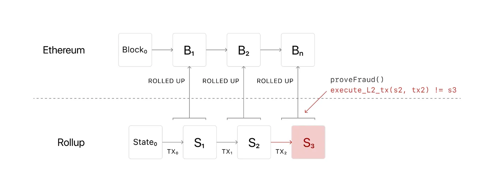

+++
tags = "web3, evm"
date = "19 October, 2024"
+++

# Part 4: Fraud Proof

Based on the block header, we can challenge the block proposers if any faults are identified.



[@preview](https://github.com/tuphan-dn/simple-l2-tut/tree/p4)

## Prove/Verify in Merkle Trie

We implement 2 important functions `prove` and `verify`, which generate a valid Merkle proof for a leaf and verify the proof, respectively.

```ts label="trie.ts" group="merkle"
// Insert these function in to the trie.tx which is defined in part 3

export default class Trie {
  ...
  prove = async (key: boolean[]): Promise<Array<Uint8Array | undefined>> => {
    const relatives = async (
      key: boolean[],
    ): Promise<Array<Uint8Array | undefined>> => {
      if (!key.length) return []
      const [bit, ...rest] = key
      return [await this.get([!bit, ...rest]), ...(await relatives(rest))]
    }
    const value = await this.get(key)
    return [value, ...(await relatives(key))]
  }

  verify = async (
    key: boolean[],
    proof: Array<Uint8Array | undefined>,
  ): Promise<boolean> => {
    if (key.length + 1 !== proof.length || !proof.length) return false
    const [node, ...relatives] = proof
    let cache = node
    for (let i = 0; i < key.length; i++) {
      const bit = key[i]
      const left = !bit ? cache : relatives[i]
      const right = !bit ? relatives[i] : cache
      cache = hash({ left, right })
    }
    return cache?.toString() === (await this.root())?.toString()
  }
  ...
}
```

> To learn about [Merkle Trie](/blog/merkle-trie-the-definition-and-applications)

Similarly, we also implement a Solidity version of `verify` to enable the smartcontract to validate a leaf node against a block header, which is a Merkle root.

```solidity label="Rollup.sol" group="verify"
// SPDX-License-Identifier: UNLICENSED
pragma solidity ^0.8.24;

import 'hardhat/console.sol';

struct Block {
  bytes32 prev;
  uint256 timestamp;
}

struct Tx {
  address from;
  address to;
  uint256 amount;
  bytes32 witness;
}

struct Node {
  bool[] key;
  bytes value;
}

contract Rollup {
  bytes32 public latest =
    0xab2344d27f94c1e4753f34becf3bbe88aea4caf33c2380c85b4e4ef6f286e6d1;
  mapping(bytes32 root => Block block) chain;
  mapping(address account => mapping(bytes32 root => bool unlocked)) unlocks;

  modifier unlockable(bytes32 header) {
    require(!unlocks[msg.sender][header], 'Already unlocked.');
    require(
      chain[header].timestamp + 60 < block.timestamp,
      'Still in the challenge window.'
    );
    _;
    unlocks[msg.sender][header] = true;
  }

  modifier referable(bytes32 root, bytes32 prev) {
    require(prev == latest, 'Invalid latest block.');
    _;
    latest = root;
  }

  modifier merkle(
    Node calldata node,
    bytes[] calldata proof,
    bytes32 root
  ) {
    require(verify(node, proof, root), 'Invalid proof');
    _;
  }

  event Lock(address indexed account, uint256 amount);
  event Unlock(address indexed account, uint256 amount);
  event Propose(
    address indexed account,
    bytes32 indexed root,
    bytes32 indexed prev
  );

  function verify(
    Node memory node,
    bytes[] memory proof,
    bytes32 root
  ) private pure returns (bool) {
    bytes memory cache = node.value;
    for (uint i = 0; i < node.key.length; i++) {
      bool bit = node.key[i];
      bytes memory left = !bit ? cache : proof[i];
      bytes memory right = !bit ? proof[i] : cache;
      cache = hash(left, right);
    }
    return root == bytes32(cache);
  }

  function hash(
    bytes memory left,
    bytes memory right
  ) private pure returns (bytes memory) {
    bytes32 undefined = keccak256('');
    if (keccak256(left) != undefined || keccak256(right) != undefined) {
      return bytes.concat(keccak256(bytes.concat(left, right)));
    } else {
      return bytes('');
    }
  }

  function lock() public payable {
    emit Lock(msg.sender, msg.value);
  }

  function unlock(
    uint256 amount,
    bytes32[] calldata proof
  ) public unlockable(proof[proof.length - 1]) {
    // Merkle proof here
    payable(msg.sender).transfer(amount);
    emit Unlock(msg.sender, amount);
  }

  function propose(
    bytes32 root,
    bytes32 prev,
    Tx[] calldata txs
  ) public referable(root, prev) {
    chain[root] = Block({prev: prev, timestamp: block.timestamp});
    emit Propose(msg.sender, root, prev);
  }

  function challenge(
    bytes32 root,
    Node calldata prevState,
    bytes[] calldata prevStateProof,
    Node calldata transaction,
    bytes[] calldata txProof,
    Node calldata nextState,
    bytes[] calldata nextStateProof
  )
    public
    merkle(prevState, prevStateProof, chain[root].prev)
    merkle(transaction, txProof, root)
    merkle(nextState, nextStateProof, root)
  {
    uint256 prev = uint256(bytes32(prevState.value));
    Tx memory trans = Tx({
      from: address(bytes20(transaction.value[0:20])),
      to: address(bytes20(transaction.value[20:40])),
      amount: uint256(bytes32(transaction.value[40:72])),
      witness: bytes32(transaction.value[72:104])
    });
    uint256 next = uint256(bytes32(nextState.value));
    require(prev + trans.amount != next, 'The block is honest');
    // Rollback the malicious block
    latest = chain[root].prev;
  }
}
```

```json label="Rollup.json" group="verify"
[
  {
    "anonymous": false,
    "inputs": [
      {
        "indexed": true,
        "internalType": "address",
        "name": "account",
        "type": "address"
      },
      {
        "indexed": false,
        "internalType": "uint256",
        "name": "amount",
        "type": "uint256"
      }
    ],
    "name": "Lock",
    "type": "event"
  },
  {
    "anonymous": false,
    "inputs": [
      {
        "indexed": true,
        "internalType": "address",
        "name": "account",
        "type": "address"
      },
      {
        "indexed": true,
        "internalType": "bytes32",
        "name": "root",
        "type": "bytes32"
      },
      {
        "indexed": true,
        "internalType": "bytes32",
        "name": "prev",
        "type": "bytes32"
      }
    ],
    "name": "Propose",
    "type": "event"
  },
  {
    "anonymous": false,
    "inputs": [
      {
        "indexed": true,
        "internalType": "address",
        "name": "account",
        "type": "address"
      },
      {
        "indexed": false,
        "internalType": "uint256",
        "name": "amount",
        "type": "uint256"
      }
    ],
    "name": "Unlock",
    "type": "event"
  },
  {
    "inputs": [
      {
        "internalType": "bytes32",
        "name": "root",
        "type": "bytes32"
      },
      {
        "components": [
          {
            "internalType": "bool[]",
            "name": "key",
            "type": "bool[]"
          },
          {
            "internalType": "bytes",
            "name": "value",
            "type": "bytes"
          }
        ],
        "internalType": "struct Node",
        "name": "prevState",
        "type": "tuple"
      },
      {
        "internalType": "bytes[]",
        "name": "prevStateProof",
        "type": "bytes[]"
      },
      {
        "components": [
          {
            "internalType": "bool[]",
            "name": "key",
            "type": "bool[]"
          },
          {
            "internalType": "bytes",
            "name": "value",
            "type": "bytes"
          }
        ],
        "internalType": "struct Node",
        "name": "transaction",
        "type": "tuple"
      },
      {
        "internalType": "bytes[]",
        "name": "txProof",
        "type": "bytes[]"
      },
      {
        "components": [
          {
            "internalType": "bool[]",
            "name": "key",
            "type": "bool[]"
          },
          {
            "internalType": "bytes",
            "name": "value",
            "type": "bytes"
          }
        ],
        "internalType": "struct Node",
        "name": "nextState",
        "type": "tuple"
      },
      {
        "internalType": "bytes[]",
        "name": "nextStateProof",
        "type": "bytes[]"
      }
    ],
    "name": "challenge",
    "outputs": [],
    "stateMutability": "nonpayable",
    "type": "function"
  },
  {
    "inputs": [],
    "name": "latest",
    "outputs": [
      {
        "internalType": "bytes32",
        "name": "",
        "type": "bytes32"
      }
    ],
    "stateMutability": "view",
    "type": "function"
  },
  {
    "inputs": [],
    "name": "lock",
    "outputs": [],
    "stateMutability": "payable",
    "type": "function"
  },
  {
    "inputs": [
      {
        "internalType": "bytes32",
        "name": "root",
        "type": "bytes32"
      },
      {
        "internalType": "bytes32",
        "name": "prev",
        "type": "bytes32"
      },
      {
        "components": [
          {
            "internalType": "address",
            "name": "from",
            "type": "address"
          },
          {
            "internalType": "address",
            "name": "to",
            "type": "address"
          },
          {
            "internalType": "uint256",
            "name": "amount",
            "type": "uint256"
          },
          {
            "internalType": "bytes32",
            "name": "witness",
            "type": "bytes32"
          }
        ],
        "internalType": "struct Tx[]",
        "name": "txs",
        "type": "tuple[]"
      }
    ],
    "name": "propose",
    "outputs": [],
    "stateMutability": "nonpayable",
    "type": "function"
  },
  {
    "inputs": [
      {
        "internalType": "uint256",
        "name": "amount",
        "type": "uint256"
      },
      {
        "internalType": "bytes32[]",
        "name": "proof",
        "type": "bytes32[]"
      }
    ],
    "name": "unlock",
    "outputs": [],
    "stateMutability": "nonpayable",
    "type": "function"
  }
]
```

## Challenge

[@preview](https://github.com/tuphan-dn/isolated-tests-for-rollups-challenge-games)

The `challenge` function will use `verify` to validate the provided `prevState`, `transition`, and `nextState`. Since the `transition` and `nextState` are reflected by the `root`, and the `prevState` is reflected by the `root.prev`, this creates a stateful transition. We can re-execute the `transition` on the `prevState` and then compare it to the `nextState`.

In the context of the OP Stack, we are building a one-shot proof and an EVM simulation for the re-execution process. The example of `challenge` in [Prove/Verify in Merkle Trie](#proveverify-in-merkle-trie) is to validate the incorrect compuation. Other types of attacks can be validated either through a Merkle proof or by using the EVM simulation.

To test it, we will build a two-actor example where Alice is an honest sequencer and Bob is a malicious sequencer. Alice will challenge the fraudulent block proposed by Bob. First, we create a fraudable version of `sequencer.execute`.

```ts label="sequencer.ts" group="fraud"
export default class Sequencer extends Contract {
  ...
  execute = async (txs: Tx[], fraud = false) => {
    console.log(txs.map((tx) => tx.decode()))
    const prev = (await this.contract.read.latest()) as string
    for (const tx of txs) {
      await txTrie.put(bytesToBinary(tx.txId), tx.data)
      const from =
        (await stateTrie.get(bytesToBinary(tx.from))) ||
        hexToBytes(''.padStart(64, '0'))
      const to =
        (await stateTrie.get(bytesToBinary(tx.to))) ||
        hexToBytes(''.padStart(64, '0'))
      await stateTrie.put(
        bytesToBinary(tx.from),
        fraud ? from : bigintToBytes(bytesToBigInt(from) - tx.amount), // If the sequencer is malicious, he doesn't minus the amount
      )
      await stateTrie.put(
        bytesToBinary(tx.to),
        bigintToBytes(bytesToBigInt(to) + tx.amount),
      )
    }
    const root: Hex = `0x${bytesToHex(
      hash({
        left: hexToBytes(prev.substring(2)),
        right: hash({
          left: await txTrie.root(),
          right: await stateTrie.root(),
        }),
      })!!,
    )}`
    return root
  }
}
```

In addition, `execute` we recompute the `root` and return it on every steps.

## Unlock

Once a block passes the timeframe and reaches finality without any successfull challenges, it is considered as a secure (confirmed) block, and users can safely unlock their ETH. I, the author, will leave the `unlock` function as a homework assignment so you can exercise your understanding of it.
