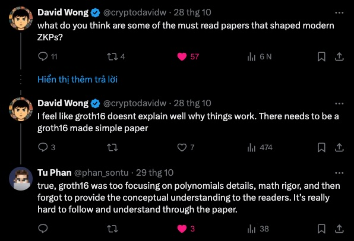

+++
tags = "cryptography, math"
date = "31 December, 2024"
+++

# The Groth16 Intuition

_"Hi, saw you on twitter. I'm trying to understand groth16. I have a quick question, why is alpha and beta used? The paper says it ensures A,B,C are consistent with each other in choice of public and private inputs. Not sure, how that is ensured."_, Saksham Thapa asked me in an email.

Honestly, I just followed the paper without asking the motivation behind $\alpha, \beta$ and $\gamma, \delta$ furthermore. In this article, I won't go through the math details cause the assumption that the readers was familiar with Eliptic Curve, Pairing-based Cryptosystem, R1CS, QAP, Lagrange Intherpolation, ...

## Notation

Given 3 elliptic curve groups $\mathbb{G}_1, \mathbb{G}_2, \mathbb{G}_T$ with an pairing $\mathbf{e}$: $\mathbb{G}_1 \times \mathbb{G}_2 \rightarrow \mathbb{G}_T$, we can write that $\mathbf{e}([x]_1,[x]_2) = [x]_T$ where $[x]_1 \in \mathbb{G}_1$, $[x]_2 \in \mathbb{G}_2$, $[x]_T \in \mathbb{G}_T$.

Capital letters (e.g. a matrix $M$) usually refer matrice. Otherwise, lowercase letters (e.g. a vector $v$) refer vectors and $v_i$ refers the element $i$-th in the vector $v$.

A $d$-degree polynomial $f(x)$ has coefficients ($f_0, f_1, \dots, f_d$) (i.e., $f(x) = f_0 + f_1 x + \dots + f_d x^d$).

Finally, $\mathbb{F}_q$ refers a finite field with order $q$.

## Completeness & Succinctness

It's necessary to recall that Groth16 is a ZK framework. It can "zk-ish" problems that can be defined under the form of algebraic circuits (i.e., binary inputs and NAND gates).

### R1CS

However, we can computationally improve the performance of proving and verifying by tranforming the algebraic circuit to a Rank-1 Constraint System (R1CS), which is a basic arithmetic circuit (i.e., interger inputs and adddition/multiplication gates).

For example, you know the tuple $(x,y)$ so that $z = xy + 7y - 5$ where $z$ is public and a product of 2 large primes. Importantly, all computation is in $\mathbb{F}_q$. Then you can transform both the problem and the solution to R1CS.

$$
\begin{align*}
t &= xy\\
5+z-t &= 7y\\
\end{align*}
$$

and the witness vector would be $a = (1,z,t,x,y)^{\top}$.

To compact the system of equations, we rewrite them as an agebraic product:

$$
\begin{bmatrix}
0 & 0 & 1 & 0 & 0\\
5 & 1 & -1 & 0 & 0\\
\end{bmatrix}

\begin{bmatrix}
1 \\
z \\
t \\
x \\
y \\
\end{bmatrix}

=

\begin{bmatrix}
0 & 0 & 0 & 1 & 0\\
7 & 0 & 0 & 0 & 0\\
\end{bmatrix}

\begin{bmatrix}
1 \\
z \\
t \\
x \\
y \\
\end{bmatrix}

\circ
\begin{bmatrix}
0 & 0 & 0 & 0 & 1\\
0 & 0 & 0 & 0 & 1\\
\end{bmatrix}

\begin{bmatrix}
1 \\
z \\
t \\
x \\
y \\
\end{bmatrix}
$$

In short, $Oa = La \circ Ra$. Here, we intuitively realize that the first element of $1$ in the witness vector is always required to cover the case of adding scalar. $\quad \blacksquare$

### QAP

Now we got $O$, $L$, $R$ are $(m \times n)$ matrice and $a$ is the witness $(n \times 1)$ vector. To verify the equation, $Oa \overset{?}{=} La \circ Ra$, the verifier may process all matrix computation. With a large R1CS, the work is pretty heavy to the verifier.

Because Lagrange interpolation is homomorphic, we can compress the equation $Oa = La \circ Ra$ to

$$
\begin{bmatrix}
w_1(x) \dots w_n(x)
\end{bmatrix}

\begin{bmatrix}
a_1 \\
\vdots \\
a_n
\end{bmatrix}

=

\begin{bmatrix}
u_1(x) \dots u_n(x)
\end{bmatrix}

\begin{bmatrix}
a_1 \\
\vdots \\
a_n
\end{bmatrix}

\circ

\begin{bmatrix}
v_1(x) \dots v_n(x)
\end{bmatrix}

\begin{bmatrix}
a_1 \\
\vdots \\
a_n
\end{bmatrix}
$$

or

$$
\sum_{i=1}^n w_i(x)a_i
=
\sum_{i=1}^n u_i(x)a_i
\circ
\sum_{i=1}^n v_i(x)a_i
$$

where $w_i(x)$ is the $m$-degree polynomial interpolating the $i$-th column vector in $O$; similarly to $u_i(x)$ with $L$, and $v_i(x)$ with $R$. In other words, $w_i(j) = O_{ji}$, $u_i(j) = L_{ji}$, $v_i(j) = R_{ji}$. Especially, $\circ$ now doesn't refer a polynomial multiplication but a scalar multiplication that is only defined at $x = 1, \dots, m$.

It's clear to see that the matrix production equation verification is equivalent to the polynomial evaluation at $x = 1, \dots, m$.

Let's $t(x)=(x-1) \dots (x-m)$, then $w(x) = \sum_{i=1}^n w_i(x)a_i \mid t(x)$, $u(x) = \sum_{i=1}^n u_i(x)a_i \mid t(x)$, and $v(x) = \sum_{i=1}^n v_i(x)a_i \mid t(x)$ due to the factor theorem. Now, we are able to translate the $\circ$ to a polynomial multiplcation.

$$
w(x) = u(x) \circ v(x) \Leftrightarrow w(x) + h(x)t(x) = u(x)v(x)
$$

where $h(x) = \frac{u(x)v(x)-w(x)}{t(x)}$ has the degree $m-2$.

However, we can even make the verification more succint by the Schwartz-Zippel Lemma. Roughly speaking, if two $d$-degree polynomials $f(x)$ and $g(x)$ both agree on a random $\tau$ (i.e., $f(\tau)=g(\tau)$), then $f(x)=g(x)$ with a very high probability.

It means we don't have to compute every coefficients of $w(x) + h(x)t(x)$ and $u(x)v(x)$ for comparison, instead evaluating the equation at a random $\tau$,

$$
w(\tau) + h(\tau)t(\tau) \overset{?}{=} u(\tau)v(\tau)
$$

, is pretty enough for any conclusion. $\quad \blacksquare$

## Zero-knowledge

What if we can prove the QAP statement, $w(\tau) +h(\tau)t(\tau) = u(\tau)v(\tau)$, without revealing the polynomails? That's the important intuition for zero-knowlege things.

To stop people learning the polynomials, we can map the computation in the current finite field to a pairing-based cryptosystem.

$$
e([w(\tau) + h(\tau)t(\tau)]_1, G_2) = e([u(\tau)]_1, [v(\tau)]_2)
$$

Thus, we need to give him corressponding "encoded" values of $(\tau, \dots, \tau^m)$ to help the prover able to compute those values.

**Trusted Setup.** A third-party securely choose a random scalar $\tau$ and open the common reference strings (CRS) as:

$$
\begin{align*}
&\{G_1, \tau G_1, \dots, \tau^{m-1} G_1, \tau^m G_1\}\\
&\{G_2, \tau G_2, \dots, \tau^{m-1} G_2, \tau^m G_2\}\\
&\{t(\tau) G_1, \tau t(\tau) G_1, \dots, \tau^{m-2} t(\tau) G_1\}\\
\end{align*}
$$

By the trusted setup, the prover can open the proof

$$
\begin{align*}
&[w(\tau) + h(\tau)t(\tau)]_1 &&= w_0 G_1 + w_1 \tau G_1 + \dots + w_m \tau^m G_1\\
&&&+ h_0 t(\tau) G_1 +  h_1 \tau t(\tau) G_1 + \dots + h_{m-2} \tau^{m-2} t(\tau) G_1\\
&[u(\tau)]_1 &&= u_0 G_1 + u_1 \tau G_1 + \dots + u_m \tau^m G_1\\
&[v(\tau)]_2 &&= v_0 G_2 + v_1 \tau G_2 + \dots + v_m \tau^m G_2\\
\end{align*}
$$

without revealing the polynomial. Note that the prover also doesn't learn about the value of $\tau$. $\quad \blacksquare$

## Soundness

### alpha & beta

How do we know the prover genuinely derive $w(x)$, $u(x)$, $v(x)$ from $\{w_i(x)\}_{i=1..n}$, $\{u_i(x)\}_{i=1..n}$, $\{v_i(x)\}_{i=1..n}$, which is publicly known by the prover and the verifier?

If there exists no mechanisms to ensure that, the prover just randomly pick a valid $w'(x)$, $u'(x)$, and $v'(x)$ to fake the QAP equation and throw the verifier a maliciously valid proof. On the o the hand, the verifier can't verify such $w'(\tau) \overset{?}{=} \sum_{i=0}^n w_i(\tau)$.

To prevent forged proofs, Groth16 tries to create a relationship between $w(x)$, $u(x)$, and $v(x)$ while the trusted setup by injecting 2 randoms, $\alpha$ and $\beta$. The relationship must be computable under the pairing-based cryptosystem.

**Trusted Setup.** A third-party securely choose random scalars $\alpha, \beta$ and open the common reference strings (CRS) as:

$$
\alpha G_1, \beta G_2, \{(\alpha v_i(x) + \beta u_i(x) + w_i(x)) G_1\}_{i=1..n}
$$

We update the pairing proof to

$$
\begin{align*}
e([u(\tau)+\alpha]_1,[v(\tau)+\beta]_2) &= e([(u(\tau)+\alpha)(v(\tau)+\beta)]_1, G_2)\\
&= e([u(\tau)v(\tau) + \beta u(\tau) + \alpha v(\tau) + \alpha\beta]_1, G_2)\\
&= e([w(\tau) + h(\tau)t(\tau) + \beta u(\tau) + \alpha v(\tau) + \alpha\beta]_1, G_2)\\
&= e([w(\tau) + \beta u(\tau) + \alpha v(\tau) + h(\tau)t(\tau)]_1, G_2) + e([\alpha]_1,[\beta]_2)\\
\end{align*}
$$

> In some articles they write $e(A+B,G) = e(A,G) \cdot e(B,G)$. However, because $e(\cdot, \cdot)$ is also an element in the elliptic curve group $G_T$ then I prefer $e(A+B,G) = e(A,G) + e(B,G)$ for consistency.

By the trusted setup, the prover can open the genuine proof

$$
\begin{align*}
&[w(\tau) + \beta u(\tau) + \alpha v(\tau) + h(\tau)t(\tau)]_1 &&= \sum_{i=1}^n a_i (w_i(\tau) + \beta u_i(\tau) + \alpha v_i(\tau)) G_1 \\
&&&+ h_0 t(\tau) G_1 +  h_1 \tau t(\tau) G_1 + \dots + h_{m-2} \tau^{m-2} t(\tau) G_1\\
&[u(\tau) + \alpha]_1 &&= u_0 G_1 + u_1 \tau G_1 + \dots + u_m \tau^m G_1 + \alpha G_1\\
&[v(\tau) + \beta]_2 &&= v_0 G_2 + v_1 \tau G_2 + \dots + v_m \tau^m G_2 + \beta G_2\\
\end{align*}
$$

without learning $\alpha$, $\beta$, and $\tau$.

> Not to be confused between the interpolating polynomials $w_i(x), u_i(x), v_i(x)$ and the polynomial coefficients $w_i, u_i, v_i$.

Now, the malicious prover must know $\alpha$ and/or $\beta$ to manipulate the QAP equation, which is theoritically impossible. $\quad \blacksquare$

### gamma & delta

With 2 different tuples $(x, y, z)$, $(x', y', z')$ that satisfy $z = xy+7y−5$ and $z'=x'y'+7y'−5$ respectively, the structure of $w(x)$, $u(x)$, and $v(x)$ is the identical to each other. So the previous trusted setup can't detect if the macilious prover tries to replace an "easier" $z'$ to $z$ in the witness vector to find $x'$, $y'$. Eventually, the malicious prover will provide a fake valid proof $[1, z', t', x', y']^{\top}$ to a naive verifier.

There 2 segments in the witness vector $a$. The segment $(1,z)$ in the witness is public and the segment $(t,x,y)$ is private. To stop the prover forging the public segment in $a$, Groth16 injects $\gamma$ and $\delta$ into the trusted setup.

Let's say the first $\ell$ elements in $a$ are public and the rest is private.

$$
[\overset{\text{public}}{\overbrace{a_1, \cdots, a_\ell}},\overset{\text{private}}{\overbrace{a_{\ell+1}, \cdots, a_n}}]^{\top}
$$

Recall the previous trusted setup,

$$
\begin{align*}
&[w(\tau) + \beta u(\tau) + \alpha v(\tau) + h(\tau)t(\tau)]_1\\
&= \sum_{i=1}^n a_i (w_i(\tau) + \beta u_i(\tau) + \alpha v_i(\tau)) G_1 + h_0 t(\tau) G_1 +  h_1 \tau t(\tau) G_1 + \dots + h_{m-2} \tau^{m-2} t(\tau) G_1\\
\end{align*}
$$

, we separate the term of $\sum_{i=1}^n a_i (w_i(\tau) + \beta u_i(\tau) + \alpha v_i(\tau)) G_1$ into a public part and a private part:

$$
\begin{align*}
&\sum_{i=1}^n a_i (w_i(\tau) + \beta u_i(\tau) + \alpha v_i(\tau)) G_1\\
&= \sum_{i=1}^\ell a_i (w_i(\tau) + \beta u_i(\tau) + \alpha v_i(\tau)) G_1 + \sum_{i=\ell+1}^n a_i (w_i(\tau) + \beta u_i(\tau) + \alpha v_i(\tau)) G_1\\
&= \sum_{i=1}^\ell a_i \frac{w_i(\tau) + \beta u_i(\tau) + \alpha v_i(\tau)}{\gamma} \gamma G_1 + \sum_{i=\ell+1}^n a_i \frac{w_i(\tau) + \beta u_i(\tau) + \alpha v_i(\tau)}{\delta} \delta G_1
\end{align*}
$$

The we can rewrite $e([w(\tau) + \beta u(\tau) + \alpha v(\tau) + h(\tau)t(\tau)]_1, G_2)$ as:

$$
e([\sum_{i=1}^\ell a_i \frac{w_i(\tau) + \beta u_i(\tau) + \alpha v_i(\tau)}{\gamma}]_1, [\gamma]_2) + e([\sum_{i=\ell+1}^n a_i \frac{w_i(\tau) + \beta u_i(\tau) + \alpha v_i(\tau)}{\delta} + \frac{h(\tau)t(\tau)}{\delta}]_1, [\delta]_2)
$$

**Trusted Setup.** A third-party securely choose random scalars $\gamma, \delta$ and open the common reference strings (CRS) as:

$$
\begin{align*}
&\gamma G_2, \delta G_2\\
&\{\frac{\alpha v_i(x) + \beta u_i(x) + w_i(x)}{\gamma} G_1\}_{i=1..\ell}, \{\frac{\alpha v_i(x) + \beta u_i(x) + w_i(x)}{\delta} G_1\}_{i=\ell+1..n}\\
&\{\frac{t(\tau)}{\delta} G_1, \frac{\tau t(\tau)}{\delta} G_1, \dots, \frac{\tau^{m-2} t(\tau)}{\delta} G_1\}\\
\end{align*}
$$

So now, the public part is not only appropriate with the private part in the original problem, but also in the "hidden" problems by $\gamma$ and $\delta$ in the current trusted setup. $\quad \blacksquare$

## More Zero-knowledge

The protocol now appears to address most critical pitfalls. However, let's assume that there are 2 provers. After the first prover open his valid proofs, the second one will replay that proof and become a valid prover. To prevent such replay attacks, Groth16 allows provers to includes randomness into thier own proofs.

Let's say the prover will choose 2 randoms $r$, $s$ and inject into the term of

$$
e([u(\tau)+\alpha]_1, [v(\tau)+\beta]_2) \overset{r, s}{\rightarrow} e([u(\tau)+\alpha+r]_1, [v(\tau)+\beta+s]_2)
$$

, which seems a good approach. However, we can image that $r$ and $s$ is too "free" so an attacker can make up a proof $[A]_1 = [u(\tau)+\alpha+r]_1$ and $[B]_2 = [v(\tau)+\beta+s]_2$.

To prevent that potentially negative results, I strongly beleive that Groth16 was heavily inspired by Diffie-Hellman key exchange. Groth16 allows provers to includ randomnesses but not really control them. Groth16 utilize the randomess $\delta$ to merge with $r$ and $s$.

$$
\begin{align*}
[A]_1 &= [u(\tau)+\alpha+r\delta]_1 &&(= [u(\tau)+\alpha]_1+r[\delta]_1)\\
[B]_2 &= [v(\tau)+\beta+s\delta]_2 &&(= [v(\tau)+\beta]_2+s[\delta]_2)\\
\end{align*}
$$

Because the prover doesn't know the value of $\delta$, it's safe for the prover to still add the randomnesses $r[\delta]_1$ and $s[\delta]_2$ without knowing the actual values. $\quad \blacksquare$

Due to the updates in term of $[A]_1$ and $[B]_2$, we will do some math stuffs to balance the QAP equation.

$$
\begin{align*}
e([A]_1,[B]_2) &= e([u(\tau)+\alpha+r\delta]_1,[v(\tau)+\beta+s\delta]_2)\\
&= e([(u(\tau)+\alpha+r\delta)(v(\tau)+\beta+s\delta)]_1, G_2)\\
&= e([(u(\tau)+\alpha)(v(\tau)+\beta) + (u(\tau)+\alpha+r\delta)s\delta + (v(\tau)+\beta+s\delta)r\delta - rs\delta^2]_1, G_2)\\
&= e([(u(\tau)+\alpha)(v(\tau)+\beta)]_1, G_2) + e([(u(\tau)+\alpha+r\delta)s + (v(\tau)+\beta+s\delta)r - rs\delta]_1, [\delta]_2)\\
&= e([w(\tau)+u(\tau)\beta+v(\tau)\alpha]_1, G_2) + e([\alpha]_1, [\beta]_2) + e([(u(\tau)+\alpha+r\delta)s + (v(\tau)+\beta+s\delta)r - rs\delta]_1, [\delta]_2)\\

&= e([\sum_{i=1}^\ell a_i \frac{(w_i(\tau) + \beta u_i(\tau) + \alpha v_i(\tau))}{\gamma}]_1, [\gamma]_2) + e([\sum_{i=\ell+1}^n a_i \frac{w_i(\tau) + \beta u_i(\tau) + \alpha v_i(\tau)}{\delta} + \frac{h(\tau)t(\tau)}{\delta}]_1, [\delta]_2) + e([\alpha]_1, [\beta]_2) + e([As + Br - rs\delta]_1, [\delta]_2)\\

&= e([\alpha]_1, [\beta]_2) + e([\sum_{i=1}^\ell a_i \frac{w_i(\tau) + \beta u_i(\tau) + \alpha v_i(\tau)}{\gamma}]_1, [\gamma]_2) + e([\sum_{i=\ell+1}^n a_i \frac{w_i(\tau) + \beta u_i(\tau) + \alpha v_i(\tau)}{\delta} + \frac{h(\tau)t(\tau)}{\delta} + As + Br - rs\delta]_1, [\delta]_2)\\

&= e([\alpha]_1, [\beta]_2) + e([\sum_{i=1}^\ell a_i \frac{w_i(\tau) + \beta u_i(\tau) + \alpha v_i(\tau)}{\gamma}]_1, [\gamma]_2) + e([C]_1, [\delta]_2)\\
\end{align*}
$$

, where $C = \sum_{i=\ell+1}^n a_i \frac{w_i(\tau) + \beta u_i(\tau) + \alpha v_i(\tau)}{\delta} + \frac{h(\tau)t(\tau)}{\delta} + As + Br - rs\delta$.

# The Groth16 Protocol

**Trusted Setup.** A third party chooses random scalars $\alpha, \beta, \tau, \gamma, \delta \leftarrow \mathbb{F}_q$ and open the CRS:

$$
\begin{align*}
&\{[1]_1, [\tau]_1, \dots, [\tau^{m-1}]_1, [\tau^m]_1\}\\
&\{[1]_2, [\tau]_2, \dots, [\tau^{m-1}]_2, [\tau^m]_2\}\\
&[\alpha]_1, [\beta]_1, [\beta]_2, [\gamma]_2, [\delta]_1, [\delta]_2\\
&\{[\alpha v_i(\tau) + \beta u_i(\tau) + w_i(\tau)]_1\}_{i=1..n}\\
&\{[\frac{t(\tau)}{\delta}]_1, [\frac{\tau t(\tau)}{\delta}]_1, \dots, [\frac{\tau^{m-2} t(\tau)}{\delta}]_1\}\\
&\{[\frac{\alpha v_i(\tau) + \beta u_i(\tau) + w_i(\tau)}{\gamma}]_1\}_{i=1..\ell}, \{[\frac{\alpha v_i(\tau) + \beta u_i(\tau) + w_i(\tau)}{\delta}]_1\}_{i=\ell+1..n}\\
\end{align*}
$$

**Prover.** The prover generates the proofs:

$$
\begin{align*}
&[A]_1 = \sum_{i=0}^m u_i [\tau^i]_1 + [\alpha]_1 + r[\delta]_1\\
&\textcolor{red}{[B]_1} = \sum_{i=0}^m v_i [\tau^i]_1 + [\beta]_1 + s[\delta]_1\\
&[B]_2 = \sum_{i=0}^m v_i [\tau^i]_2 + [\beta]_2 + s[\delta]_2\\
&[C]_1 = \sum_{i=\ell+1}^n a_i [\frac{w_i(\tau) + \beta u_i(\tau) + \alpha v_i(\tau)}{\delta}]_1 + \sum_{i=0}^{m-2} h_i [\frac{\tau^i t(\tau)}{\delta}]_1 + [A]_1s + \textcolor{red}{[B]_1}r - rs[\delta]_1\\
\end{align*}
$$

**Verifier.** The verifier checks the equations:

$$
e([A]_1, [B]_2) \overset{?}{=} e([\alpha]_1, [\beta]_2) + e([\sum_{i=1}^\ell a_i \frac{w_i(\tau) + \beta u_i(\tau) + \alpha v_i(\tau)}{\gamma}]_1, [\gamma]_2) + e([C]_1, [\delta]_)
$$

> Happy new year, 2025, guys 🎉
