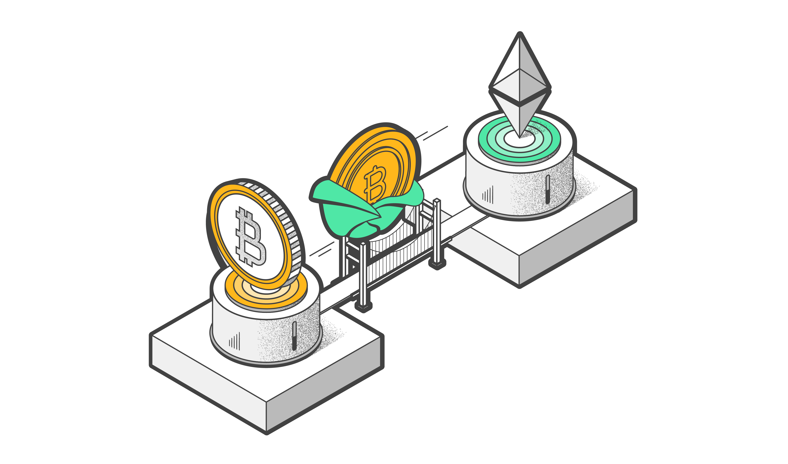
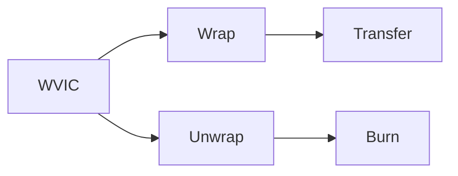

+++
tags = "evm, hardhat, solidity"
date = "17 August, 2024"
+++

# Wrapped Native Token

I have played around the Viction ecosystem (an EVM-compatible layer 1) and figured out they have no wrapped token (i.e. WVIC) on thier own blockchain. Interestedly, I used many wrapped tokens like WETH, WSOL but nener wonder how was it implemented? So I decide to build one on Viction.



## Definition

Wrapped Tokens is usually to denote a new token that pegged 1:1 to the original token but with a different technical interface to serve some specific purpose. The can deposit 1 original token to get 1 wrapped token. Otherwise, they will send back the wrapped token to withdraw thier original token.

> On some platforms, you might pay a fraction of fee. So technically, it won't be 1:1.

For example, Uniswap is designed to work with ERC20 but ETH. In order to let ETH be traded on Uniswap, they have to wrap the ETH to an ERC20-based ETH and named it WETH. Another example, people will wrap BTC on Solana to allow BTC being used as a colleteral on Solana-based lending platforms. You can obviously see that 1 ETH = 1 WETH and 1 BTC = 1 solBTC.

## WVIC

Wrap VICTION will follow VRC20 (aka. ERC20) standard. When people send VIC to the WVIC contract (with or without `msg.data`), the contract will mint the same amount WVIC to the sender. To unwrap and withdraw VIC, people call `burn`.



For convenience, instead of rewriting the ERC20 contracts, we will use the [`@openzeppelin/contracts`](https://www.npmjs.com/package/@openzeppelin/contracts).

```bash label="npm" group="install"
npm install @openzeppelin/contracts
```

```bash label="yarn" group="install"
yarn add @openzeppelin/contracts
```

```bash label="pnpm" group="install"
pnpm add @openzeppelin/contracts
```

> You can refer the full WVIC contract at [tuphan-dn/wvic](https://github.com/tuphan-dn/wvic).

```solidity label="WVIC.sol" group="contracts"
// SPDX-License-Identifier: UNLICENSED
pragma solidity ^0.8.24;

import '@openzeppelin/contracts/token/ERC20/ERC20.sol';

contract WVIC is ERC20 {
  constructor() ERC20('Wrapped Viction', 'WVIC') {}

  receive() external payable {
    _mint(msg.sender, msg.value);
  }

  fallback() external payable {
    _mint(msg.sender, msg.value);
  }

  function burn(uint256 value) public returns (bool) {
    _burn(msg.sender, value);
    payable(msg.sender).transfer(value);
    return true;
  }
}
```

## Explanation

The `fallback` and `receive` functions are `payable` functions, which means they allow people to send VIC directly to the contract and both will be trigged. The difference between them is `receive` will trigged iff. the transaction transferring VIC to the contract doesn't include `msg.data`. The `fallback` will be called if the `receive` is not defined or invoked (that why it's called _fallback_). In both functions, we will call `_mint` to release the exact amount of WVIC to the sender.

We also define a `burn` function so that the contract can subtract the amount of WVIC and return the same number of VIC to the sender.

## Facts

1. You cannot burn your allowance. If someone approve x WVIC to you, you cannot burn it directly. To do it, you may call `transferFrom` to your wallet to possess the tokens first before you can burn it.

2. You can define `fallback` only and remove `receive`. The `fallback` function is invoked in both case of transferring transaction with or without `msg.data`. However, to avoid compiler warning, I did define both `fallback` and `receive`.

3. Pegged tokens $\neq$ Wrapped tokens.
