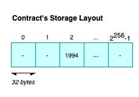
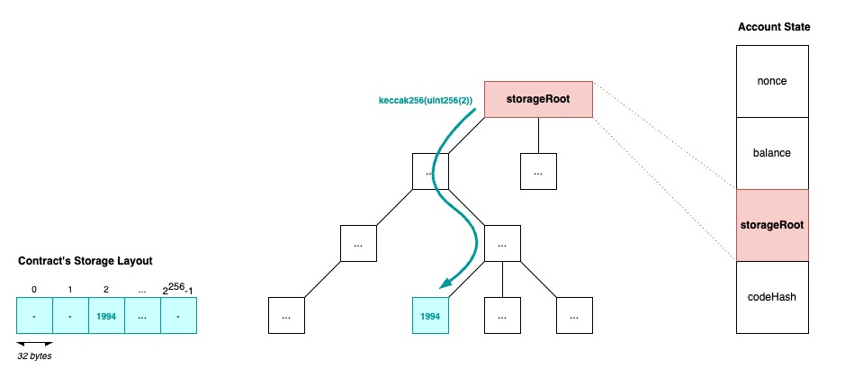
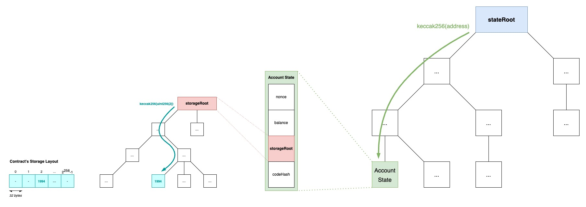
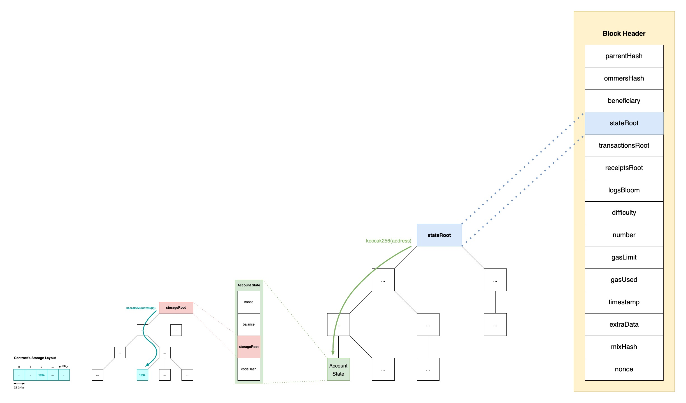

+++
tags = "evm, layer2"
date = "22 August, 2024"
+++

# Zoom out the Ethereum's Storage Layout

While I was learning the process of verification in Optimism, the question "How the state in `calldata` looks like?" just kept buzzing in my head. So this article will solve all the mysterious stuff behind the fancy words of "Merkle Trie" or "Merkle Patricia Trie" once and for all 😤.

---

# Contract storage

All statically-sized variables are laid out contiguously on **storage slots**. Each storage slot has its own index, which runs from $0$ to $2^{256}-1$, and points to a big-endian 32-bytes storage. Multiple statically-sized variables (except `struct` and `array`) could stored in a slot if they all fit in. However, `struct` and `array` always take new slots and their elements are follow the aforementioned rules. In case of contract inheritance, it will follow [C3 linearization](https://en.wikipedia.org/wiki/C3_linearization).

Dynamically-sized variables including `mapping` and dynamic `array` use a Keccak-256 hash to find the starting position. With an array at position `p`, the slot `p`-th will store the number of elements in the array and the array data will locate at `keccak256(p)`. With a mapping at position `p`, the slot `p`-th will be empty and the data of key `k` will locate at `keccak256(k|p)`
, where `|` is concatenation.

For example,

```solidity label="layout.sol" group="layout"
// SPDX-License-Identifier: GPL-3.0
pragma solidity >=0.4.0 <0.7.0;

contract C {
    struct S { uint a; uint b; } // This is a data type, not a variable
    uint x; // The storage slot #0
    mapping(uint => mapping(uint => S)) data; // The storage slot #1 is empty
}
```

The slot of `data[4][9]` will start at:

$$
\begin{aligned}
&x = \textcolor{red}{keccak256(}\\
& \quad uint256(9) | \textcolor{green}{keccak256(}\\
& \qquad uint256(4) | uint256(1)\\
& \quad \textcolor{green}{)}\\
&\textcolor{red}{)}
\end{aligned}
$$

Additionally, the data of `data[4][9].a` is locate at $x$ and the data of `data[4][9].b` is locate at $x+1$.

All these knowledges is not really interesting. The thing we must notice is that the contract storage is a strip of 32-byte length slots. The $key$ is a 32-byte integer and the $value$ is a [RLP-encoded](https://ethereum.org/en/developers/docs/data-structures-and-encoding/rlp/) 32-byte integer.



---

# Account State

The account state consists of $nonce$, $balance$, $storageRoot$, and $codeHash$. Focusing on $storageRoot$, it stores the root hash of [Merkle Patricia Trie](https://ethereum.org/en/developers/docs/data-structures-and-encoding/patricia-merkle-trie/) (MPT). We know that for a pair of $(key,value)$, the $key$ represents the path and the $value$ is the leaf content in MPT. Mapping the knowledge into the [Contract Storage](#contract-storage), a storage slot `p` with `value` is encoded to a pair of $(keccak256(p), RLP(value))$ and added to the MPT.



---

# World State

Every [Account State](#account-state) will be hold by an 20-byte-length address. It will form an account

$$
\begin{aligned}
&(\\
&\quad keccak256(addr),\\
&\quad RLP(\\
&\qquad nonce,\\
&\qquad balance,\\
&\qquad storageRoot,\\
&\qquad codeHash\\
&\quad)\\
&)
\end{aligned}
$$

All accounts in the world will be organized into an MPT and yield out a $stateRoot$.



> There are 2 more tries namely Transaction Trie, and Transaction Receipt Trie, which I believe they follow the same strategy as the World State Trie.

---

# Block Header

Push the [World State](#world-state) along with other data into a block header.



---

# Back to Optimism

Instead of executing transactions onchain and relying on the Layer 1's throughput, Optimism just does it offchain then submits the logs onto the Layer 1 (i.e. Ethereum) as a proof of execution and validation to significantly reduce the cost. The logs are states that stored in onchain transactions' `calldata`.

The submitted states includes:

**Output Root.** It is a 32-byte string of $keccak256(versionByte | payload)$ where $versionByte$ is a 32-byte simple string of the [L2 Output Commitment](https://specs.optimism.io/protocol/proposals.html#l2-output-root-proposals-specification) version, and $payload$ is

$$
\begin{aligned}
payload =& \; stateRoot\\
|& \; withdrawalStorageRoot\\
|& \; latestBlockHash
\end{aligned}
$$

**Batch.** It is a concatenation of $(batchVersion|content)$ where

$$
\begin{aligned}
&content = RLP(\\
& \quad parentHash,\\
& \quad epochNumber,\\
& \quad epochHash,\\
& \quad timestamp,\\
& \quad transactionList\\
&)
\end{aligned}
$$
